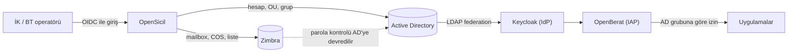
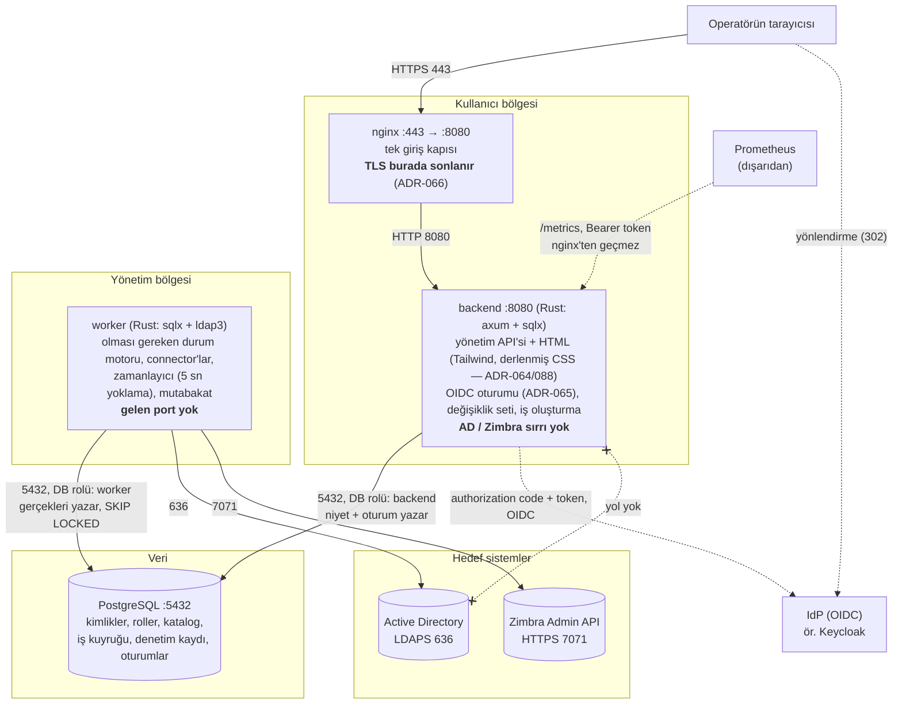
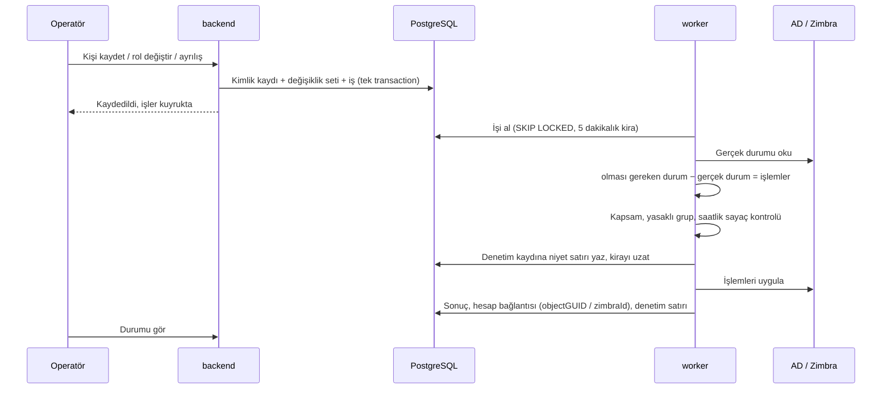
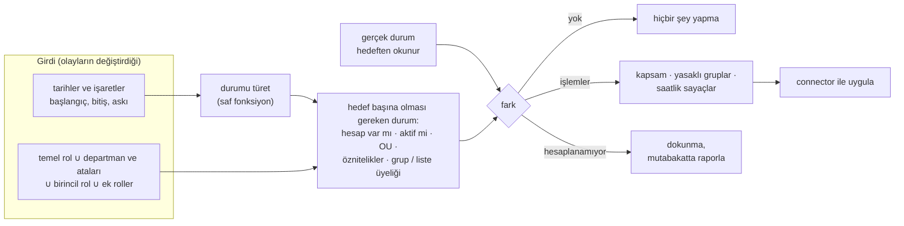
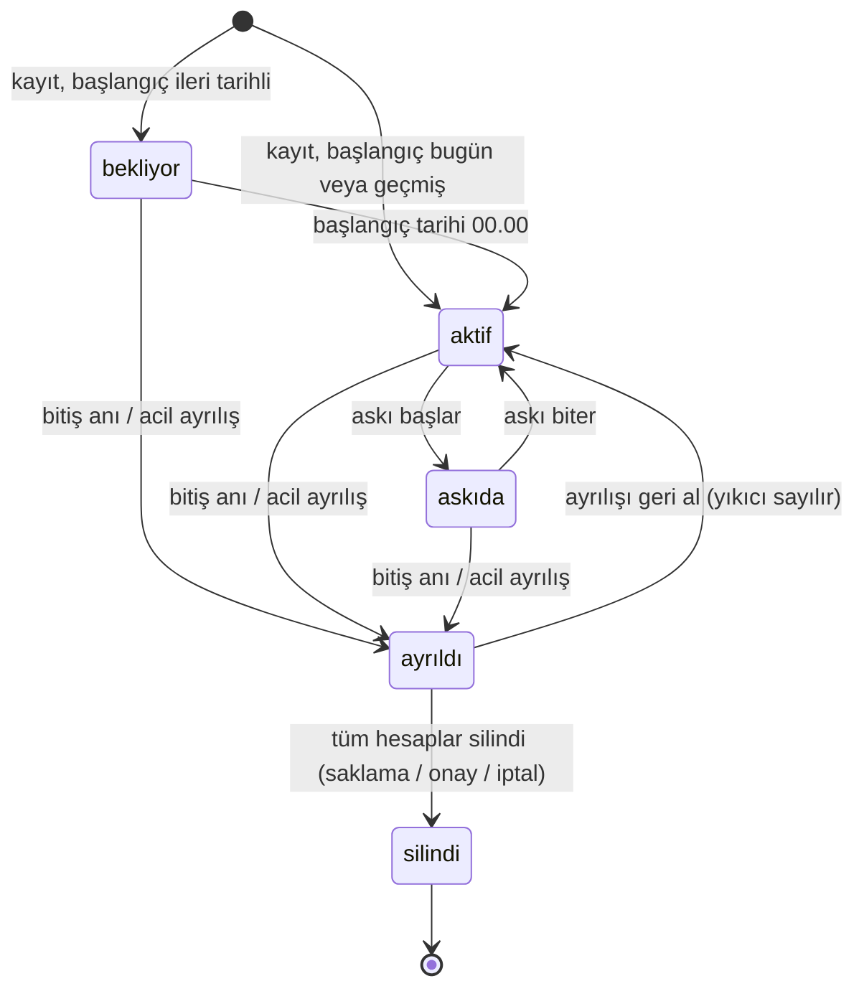

# OpenSicil

*English: [README_ENG.md](README_ENG.md)*

OpenSicil, kendi Active Directory'sini işleten kurumlar için açık kaynak bir **IGA** (kimlik yönetişimi ve yönetimi) ürünüdür. İK bir kişiyi kaydettiğinde, kişinin departmanına ve rollerine göre AD hesabını açar, doğru OU'ya yerleştirir, gruplara ekler ve Zimbra'da mailbox oluşturur. Görev değişikliğinde yetkileri günceller; ayrılışta hesapları kapatır ve saklama süresi dolunca siler.

**Hedef sahne:** Kişi işe gelir; İK adını, soyadını, kimlik numarasını, telefonunu ve birimini girer, "parolanız bu" der; kişi o dakikadan itibaren AD hesabı, grupları, mailbox'ı ve bunlardan yetki okuyan her şeyle çalışır, 60 saniyenin altında ([ADR-056](docs/decisions/056-ise-baslama-gunu-akisi.md)).

## Durum

**Tasarım aşaması. Henüz uygulama kodu yok.** Tasarım 12 tasarım belgesi ve 62 karar kaydı (ADR) olarak yazıldı; İK operatörü, IGA mimarı ve nöbetteki işletmeci gözüyle birkaç kez gözden geçirildi; 56 teknik iddia birincil kaynaklara (Zimbra ve Samba kaynak kodu, Microsoft protokol belgeleri, `ldap3`, Keycloak) karşı sınandı, dördü yanlış çıktı ve düzeltildi ([ADR-057](docs/decisions/057-birincil-kaynak-dogrulamasi.md), [docs/11](docs/11-dogrulama-notlari.md)). Sıradaki adım iskelettir (Faz 1a).

## Hangi sorunu çözer

- Hesap ve yetkiler elle, yöneticiden yöneticiye farklı açılıyor.
- Ayrılanların hesapları açık kalıyor.
- Görev değiştirenlerde yetkiler birikiyor.

## Ürün nerede duruyor

OpenSicil üç soruyu birbirinden ayırır ve yalnızca birincisini cevaplar:

| Soru | Kim cevaplar |
|---|---|
| **Bu kişi hangi sistemlerde hangi hesap ve yetkilere sahip olmalı?** | **OpenSicil** |
| Bu kişi gerçekten o kişi mi (giriş, MFA)? | IdP: Keycloak, Entra ID, AD'nin kendisi |
| Bu istek bu uygulamaya geçebilir mi? | Uygulamanın kendisi ya da OpenBerat gibi bir IAP |

OpenSicil uygulamalara doğrudan dokunmaz. Uygulama erişimi AD grubu üzerinden verilir; grubu okuyan her şey (Keycloak arkasındaki SSO, LDAP ile giriş, VPN/RADIUS, dosya paylaşımları, OpenBerat) **hiç connector olmadan** çalışır ([ADR-008](docs/decisions/008-uygulama-yetkileri-ad-gruplari.md)).

## Mimari

Dört container, tek depo, ayrı bir frontend container'ı yok. Bütün tasarım tek bir kurala dayanır: **kullanıcıya bakan bileşen, AD'ye yazabilen sırları hiç tutmaz.**

| Bileşen | Görev | Ağ |
|---|---|---|
| **nginx** | Tek giriş kapısı; host'ta yalnızca bu serviste port açık (443, TLS burada sonlanır — [ADR-066](docs/decisions/066-tls-nginxte-sonlanir.md); önünde ayrı bir proxy/Ingress varsa düz HTTP'ye alınabilir) | Dışarıya açık tek port |
| **backend** | Yönetim API'si + HTML arayüzü (Tailwind şablonları, ayrı frontend yok — [ADR-064](docs/decisions/064-frontend-htmx-tailwind.md); CSS, font ve tema betiği binary'ye gömülü, dış CDN yok — ADR-088), OIDC oturumu ([ADR-065](docs/decisions/065-oidc-akisi-backend.md)), doğrulama, değişiklik seti, iş oluşturma | Yalnızca nginx'ten gelen ve veritabanına giden bağlantı. **AD'ye ve Zimbra'ya hiç bağlanmaz** |
| **worker** | Olması gereken durumu hesaplar, farkı bulur, connector'larla uygular, zamanlanmış işleri çalıştırır | Gelen bağlantı yok. Yalnızca veritabanına, AD'ye ve Zimbra'ya giden bağlantı |
| **db** | PostgreSQL: kimlikler, roller, katalog, iş kuyruğu, denetim kaydı, OIDC oturumları | Yalnızca backend ve worker |

**Neden iki süreç:** AD'de hesap açıp gruba ekleyebilen sırlar kurumun en değerli sırlarındandır. İnternete bakan bileşen bunları hiç görmezse, backend'i ele geçiren saldırgan en fazla veritabanına *niyet* yazabilir. Worker'ın *gerçeklerine* (hesap bağlantısı, katalog) yazamaz, çünkü veritabanı rolleri buna izin vermez ([ADR-015](docs/decisions/015-veritabani-rolleri.md)); worker da bu niyeti uygulamadan önce kendi sınırlarıyla kontrol eder ([ADR-014](docs/decisions/014-yonetim-kapsami-ve-toplu-degisiklik-freni.md)).

**Neden ayrı bir frontend yok:** Backend zaten Rust; Tailwind ile kendi HTML'ini üretir, ayrı bir Node build zinciri ya da SPA container'ı eklenmez ([ADR-064](docs/decisions/064-frontend-htmx-tailwind.md)). CSS tek dosyaya derlenir (Tailwind standalone CLI) ve font/tema betiğiyle birlikte binary'ye gömülür; sayfa hiçbir dış adrese istek atmaz ([ADR-088](docs/decisions/088-arayuz-kabugu-derlenmis-css-tema-font.md)). nginx yalnızca TLS'i sonlandırıp isteği backend'e geçiren bir ters proxy'dir.

**Migration:** Şema değişiklikleri, aynı imajın `migrate` alt komutuyla, şema sahibi rolüyle, tek seferlik bir container olarak çalışır — backend ve worker'ın rolleri migration çalıştıramaz ([ADR-015](docs/decisions/015-veritabani-rolleri.md), [ADR-061](docs/decisions/061-dagitim-sozlesmesi-compose-ve-kubernetes.md)).

### Veri akışı

Kayıt ile uygulama birbirinden ayrıdır. AD başarılı olup Zimbra başarısız olursa kayıt tutarlı kalır; Zimbra işi tekrar denenir ve sonunda "müdahale gerekiyor" listesine düşer.

### Olması gereken durum motoru

"İşe giriş kodu", "ayrılış kodu" ya da "rol değişikliği kodu" yoktur. Tek bir hesaplama vardır:

Olaylar yalnızca girdiyi değiştirir: işe giriş başlangıç tarihini, ayrılış bitiş anını, askı iki tarihi, rol değişikliği rol listesini. Durumun kendisi **türetilir, saklanmaz** ([ADR-038](docs/decisions/038-kimlik-durumu-turetilir.md)). Aynı iş iki kez çalışırsa zararsızdır: ikincisi fark bulamaz. Mutabakat raporu da aynı hesaplamayı kullanır; sürüklenecek ikinci bir fark kodu yoktur.

### Kimlik yaşam döngüsü

| Durum | AD hesabı | AD grupları | Zimbra hesabı | Zimbra listeleri |
|---|---|---|---|---|
| **bekliyor** | Var, pasif | Rollere göre | Var, girişe kapalı, posta alır | Rollere göre |
| **aktif** | Aktif | Rollere göre | Aktif | Rollere göre |
| **askıda** | Pasif | Korunur | Girişe kapalı | Korunur |
| **ayrıldı** | Pasif; parola 7 gün sonra rastgele değiştirilir | Katalog grupları kaldırılır | Girişe kapalı | Kaldırılır |
| **silindi** | Silinir (varsayılan 90 gün) | — | Silinir (yalnızca onayla) | — |

### Dağıtım

Aynı imajlar ve tek `compose.yaml` dört topolojide çalışır ([ADR-061](docs/decisions/061-dagitim-sozlesmesi-compose-ve-kubernetes.md)). Topolojiyi kimlik sayısı değil, kurumun veritabanı ve ağ bölgesi düzeni seçtirir.

| Topoloji | Nerede ne çalışır | Not |
|---|---|---|
| **A. Tek sunucu** | Hepsi tek VM'de: `docker compose up -d` | Referans kurulum |
| **B. Uygulama + veritabanı** | Sunucu 1: nginx, backend, worker, tek seferlik `migrate`. Sunucu 2: kurumun PostgreSQL'i | `sslmode=verify-full` zorunlu: `sqlx` varsayılanı `prefer` sessizce düz metne düşer |
| **C. Ön yüz + worker** | Sunucu 1 (kullanıcı bölgesi): nginx, backend. Sunucu 2 (yönetim bölgesi): worker | AD ve Zimbra sırları sunucu 1'e hiç konmaz; backend/worker ayrımını güvenlik duvarı kendiliğinden sağlar |
| **D. Kubernetes** | backend: bir ya da daha çok kopya. worker: `replicas: 1`, `strategy: Recreate` | Chart yayımlanmaz; compose → Kubernetes eşlemesi [docs/09](docs/09-kurulum.md)'da |

Ürün chart yerine bir **süreç sözleşmesi** verir: SIGTERM'de elindeki işi bitirme, portsuz worker için `worker-health` komutu, sıra varsaymayan başlangıç, tek seferlik migration container'ı, süreç içinde durum olmaması, token'lı metrik ucu. Worker'ı çoğaltmak hız kazandırmaz: sınır tek yazma sırası ve saatlik sayaçlardır, ikisi de bilerek konmuştur.

## Neyi, neden, nasıl kararlaştırdık

62 kaydın tamamı [docs/decisions/](docs/decisions/) altındadır; açıklamalı liste [docs/PROJECT.md](docs/PROJECT.md#kararlar) içindedir. Ürünü biçimlendirenler:

### Konumlandırma

| Ne | Neden | Nasıl | ADR |
|---|---|---|---|
| OpenBerat modülü değil, bağımsız bir IGA | Kimlik yaşam döngüsü ile erişim kararı ayrı sorulardır; OpenBerat kullanmayan kurumun da aynı ihtiyacı var | Sözleşme AD grubudur: OpenSicil grubu atar, uygulama okur. İkisi birbirinin kodunu bilmez | [001](docs/decisions/001-kapsam-ve-konumlandirma.md), [008](docs/decisions/008-uygulama-yetkileri-ad-gruplari.md) |
| midPoint ya da Syncope'u ayarlamak yerine yazmak | Fark *yapılabilir* olanda değil, *küçük ve varsayılan* olandadır: tek `docker compose up`, betik dili yok, Zimbra birinci sınıf hedef, varsayılan olarak güvenli | midPoint'in kavramları ödünç alınır, kodu alınmaz. AD provisioning'den önce bir günlük midPoint denemesi planlıdır ve bir **vazgeçme tetikleyicisi** yazılıdır: gereksinimler onay akışlarına, yetki gözden geçirmeye, SoD'ye ve beşten fazla hedefe uzanırsa geliştirme durur | [002](docs/decisions/002-hazir-urun-yerine-gelistirme.md) |
| Hedef 500–5.000 kimlik | Küçük bir BT ekibinin AD ve Zimbra'yı elle işlettiği yer burasıdır | Varsayılanlar küçük kuruma uyar; eşikler 50.000 kimliğe kadar yükseltilir | [016](docs/decisions/016-hedef-olcek-ve-olcekte-calisma.md) |

### Mimari

| Ne | Neden | Nasıl | ADR |
|---|---|---|---|
| Rust (axum + sqlx) ve PostgreSQL; iş kuyruğu bir tablo | Kuyruk veritabanında olunca kimlik kaydı ile işi **aynı transaction'da** yazılır; "kayıt oldu ama iş kayboldu" olmaz, outbox deseni ve ek servis gerekmez | `SELECT … FOR UPDATE SKIP LOCKED`, 5 saniyede bir yoklama | [003](docs/decisions/003-stack-rust-postgresql.md), [028](docs/decisions/028-worker-zamanlamasi.md) |
| backend ve worker ayrı; sırlar yalnızca worker'da | Ele geçirilen web katmanı AD'ye yazamamalı | Sırlar `.env`'den servis bazında dağıtılır; üç veritabanı rolü; hesap bağlantısı ve kataloğa yalnızca worker yazar; denetim tablosu yalnızca eklemeye açıktır ve `current_user` damgalar | [004](docs/decisions/004-mimari-web-ve-worker.md), [006](docs/decisions/006-sirlar-env.md), [015](docs/decisions/015-veritabani-rolleri.md) |
| Olay başına kod yerine tek bir olması gereken durum motoru | Yeni olay türü ya da yeni hedef sistem işi katlamamalı; yeniden çalıştırmak güvenli olmalı | Olması gereken durumu saf fonksiyon hesaplar; durum kolonu yoktur, tarihlerden ve işaretlerden türetilir | [004](docs/decisions/004-mimari-web-ve-worker.md), [038](docs/decisions/038-kimlik-durumu-turetilir.md), [053](docs/decisions/053-tarihli-aski.md) |
| Motor hesaplayamadığına dokunmaz | Yeni roldeki "hesap açılsın = hayır" on yıllık mailbox'ı silmemeli; SOC'un kapattığı hesabı bir rol düzenlemesi geri açmamalı | Belirsiz bileşen atlanır ve raporlanır; etkinleştirme yalnızca durum geçişinde yapılır | [040](docs/decisions/040-motor-belirsiz-degere-dokunmaz.md), [032](docs/decisions/032-elle-pasiflestirme-korunur.md) |
| İş adım bazında değil, kimlik bazında | Sıra karışsa bile son çalışan iş doğru sonucu üretir | "Bu kimliği şu hedefte olması gereken duruma getir"; tekilleştirilir; öncelik: acil ayrılış > tek kimlik > toplu değişiklik > mutabakat | [004](docs/decisions/004-mimari-web-ve-worker.md), [016](docs/decisions/016-hedef-olcek-ve-olcekte-calisma.md) |
| Tek yazma sırası, ayrı okuma şeridi | Saatlik sayaçlar yarışsızdır; 30 dakikalık mutabakat acil ayrılışı bekletmez | Yazma şeridi kimlik işlerini sırayla çalıştırır; mutabakat ve katalog yenileme yanında çalışır, hedefe hiç yazmaz | [047](docs/decisions/047-worker-tek-sirada.md), [051](docs/decisions/051-okuma-seridi.md) |
| İş kirayla alınır; niyet işlemden önce yazılır | İş ortasında öldürülen worker ne işi ne denetim izini kaybetmeli | 5 dakikalık kira, yeniden alımda deneme hakkı azalmaz; her connector yazmasından önce denetim kaydına niyet satırı yazılır, yazılamıyorsa hedefe dokunulmaz | [062](docs/decisions/062-is-kirasi-ve-yarida-kalan-is.md) |
| Zamanlayıcı olay değil sorgu çalıştırır | Worker hafta sonu kapalı kaldıysa kaçırılan geçişler kaybolmamalı | Her tikte türetilen durum uygulananla karşılaştırılır, fark için iş açılır | [028](docs/decisions/028-worker-zamanlamasi.md) |
| Yönetim girişi OIDC ile | OpenSicil parola doğrulamamalı, IdP olmamalı | Görev ayrılığıyla altı yönetim yetkisi; ayrılmış ya da askıdaki operatörün her isteği reddedilir | [005](docs/decisions/005-yonetim-girisi-oidc.md), [019](docs/decisions/019-ilk-parola-teslimi.md), [059](docs/decisions/059-netlestirmeler-operator-geri-alma-aski-bitisi-accountexpires.md) |

### Frenler (ayarla değil, varsayılan olarak güvenli)

| Ne | Neden | Nasıl | ADR |
|---|---|---|---|
| Yönetilen kapsam ve yasaklı gruplar | Kimse bir role Domain Admins'i ya da onun iç içe üyesi bir grubu ekleyememeli | Kapsam worker'ın ortam değişkenindedir; ayrıcalıklı gruplar kataloğa hiç giremez; kontrol her işlemden önce yapılır | [014](docs/decisions/014-yonetim-kapsami-ve-toplu-degisiklik-freni.md) |
| Eşiği aşan düzenleme taslakta bekler | Tek yanlış rol düzenlemesi 300 kişinin VPN'ini kesmemeli ya da 3.000 kişiye bir paylaşım vermemeli | Etki önizlemesi tahmin değil, kesin model farkıdır; eşiğin üstünde (varsayılan 10 kimlik) başka bir yönetici onaylar; ekleme de sayılır; tek yöneticili kurum için zaman kilidi vardır | [031](docs/decisions/031-degisiklik-seti-sahneleme.md), [037](docs/decisions/037-esik-ekleme-islemlerini-sayar.md), [026](docs/decisions/026-degisiklik-seti-onayinda-zaman-kilidi.md) |
| Saatlik sayaçlar worker'da | Onay bir backend kontrolüdür, ele geçirilmiş backend onu uydurabilir; saldırgana karşı fren worker'da durmalıdır | Üç sayaç (yıkıcı, verme, ilk parola; varsayılan saatte 50); iş sayaçlara karşı bütündür; önce ekleme, sonra çıkarma | [016](docs/decisions/016-hedef-olcek-ve-olcekte-calisma.md), [050](docs/decisions/050-verme-sayaci-ve-is-butunlugu.md) |
| Mevcut hesapları sahiplenme gözlem modunda başlar | Mevcut personel ilk gün kesinti yaşamamalı | Varsayılan kapalı; worker'da doğrulanır; hesap yönetime alınana kadar motor farkı gösterir, uygulamaz | [018](docs/decisions/018-ice-aktarma-ve-sahiplenme.md) |
| Kuru çalıştırma modu | İlk kurulum, sürüm yükseltme ve yedekten dönüş prova ister | Connector yazmaları tek noktada kesilir; işler "uygulanacaktı" diye kaydeder | [054](docs/decisions/054-kuru-calistirma-ve-yedekten-donus.md) |

### Kişisel veri, parola, adlar

| Ne | Neden | Nasıl | ADR |
|---|---|---|---|
| Hiçbir yerde parola alanı yok | OpenSicil parola kasası olmamalı | İlk parolayı worker üretir, AEAD ile şifreler, bir kez gösterir, en geç 10 dakikada siler; yalnızca hiç giriş yapılmamış hesaba (`lastLogonTimestamp` boş). Zimbra parolayı AD'de doğrular, tek parola vardır | [009](docs/decisions/009-parola-yonetimi.md), [036](docs/decisions/036-ilk-parola-aead.md), [046](docs/decisions/046-kullanilmamis-hesap-lastlogontimestamp.md) |
| Kimlik numarası şifreli | Kaybolan yedek diski onu sızdırmamalı | Uygulama katmanında şifreleme; tekillik ve arama için blind index; ekranda maskeli; her görüntüleme denetime yazılır; log, URL, kuyruk ve denetim değerlerinde hiç yer almaz | [010](docs/decisions/010-kisisel-veri-kimlik-no-telefon.md) |
| Kullanıcı adı ve e-posta değişmez, tekrar kullanılmaz | Yeni gelen, ayrılanın postasını almamalı | Şablon ve sabit normalleştirme; yöneticinin serbest bırakabildiği kullanılmış ad kaydı | [011](docs/decisions/011-kullanici-adi-ve-eposta.md), [035](docs/decisions/035-kullanilmis-ad-duz-metin-serbest-birakma.md) |
| Betik dili olmadan öznitelik eşleme | AD yöneticisi Groovy öğrenmek zorunda kalmamalı; ayar kod çalıştırma yüzeyi olmamalı | Sabit dönüşümler; eşlenebilir hedef öznitelikler kodda sabit izinli listedir; `sAMAccountName` ve UPN eşlenemez | [012](docs/decisions/012-oznitelik-esleme.md), [029](docs/decisions/029-esleme-hedef-oznitelikleri-izinli-liste.md), [034](docs/decisions/034-sam-upn-esleme-disi-ve-bossa-yaz.md) |

### Yaşam döngüsü

| Ne | Neden | Nasıl | ADR |
|---|---|---|---|
| Önce pasifleştir, saklama süresi dolunca sil | Unutulmuş eski hesap geç açılmış yeni hesaptan daha tehlikelidir, ama silme geri alınamaz | Saklama hedef sistem başınadır: AD 90 gün; Zimbra mailbox'ı yalnızca onayla silinir | [013](docs/decisions/013-yasam-dongusu.md), [024](docs/decisions/024-hedef-sistem-basina-saklama-suresi.md) |
| Ayrılanın parolası 7 gün sonra rastgele değiştirilir | İlk hafta içindeki geri alma parola sıfırlama gerektirmemeli | Acil ayrılışta hemen | [033](docs/decisions/033-ayrilista-parola-gecikmesi.md) |
| Ayrılanın kendi posta yönlendirmesi ve filtreleri temizlenir | Ayrılmadan önce postasını kişisel adresine yönlendiren kişi, kilitli hesaptan kurumsal postayı almaya devam eder | Ayrılış anında temizlenir ve hesap bağlantısında saklanır; otomatik yanıt 24 saat sonra yazılır | [045](docs/decisions/045-ayrilan-postasi-yonlendirme.md), [049](docs/decisions/049-ayrilan-postasi-kullanici-yonlendirmesi-ve-gecikme.md) |
| Kayıt iptali hedefte doğrulanır | Tek yanlış tık, sahiplenilmiş on yıllık hesabı saklamasız silmemeli | Yalnızca OpenSicil'in açtığı ve hiç kullanılmamış hesap silinir; aksi halde planlı ayrılış gibi uygulanır | [048](docs/decisions/048-kayit-iptali-hedefte-dogrulanir.md) |
| Ayrılan yöneticinin astları yeniden yazılmaz, türetilir | Her astı yeniden yazmak kendi hata biçimleri olan bir toplu değişikliktir | Devir yöneticisi ayrılanın kaydında durur; astların etkin yöneticisi hesaplanır | [041](docs/decisions/041-astlarin-yoneticisi-turetilir.md) |

### Bilerek yazılmayanlar

İhtiyaç kanıtlanınca eklenir; önceden yazılırsa yalnızca bakım yükü getirir.

- Ayrı bir mesaj kuyruğu servisi (RabbitMQ, Kafka). Kuyruk PostgreSQL'de.
- Eklenti yükleme altyapısı. Connector'lar kodun içinde.
- Genel amaçlı kural / ifade dili ya da betik çalıştırma.
- İş akışı (BPMN) motoru. v1'deki tek onay adımı toplu değişiklik frenidir.
- Kendi IdP'miz ya da parola kasası.
- SSO, erişim kararı, PAM, yetki gözden geçirme kampanyaları: başka ürünlerin işi, kalıcı olarak kapsam dışı.

## Yol haritası

Her faz atlanamayan bir güvenlik ve test kapanışıyla biter ([docs/08](docs/08-gereksinimler.md#önerilen-faz-sırası)).

1. **Altyapı** — iskelet ve süreç sözleşmesi, OIDC girişi, kod olarak Samba AD + Keycloak lab'ı (midPoint denemesi burada yapılır), Zimbra keşfi
2. **Kayıt ve model** — veritabanı rolleri, kimlik, departman ağacı, roller, katalog, denetim kaydı, saf modül olarak olması gereken durum fonksiyonu
3. **AD provisioning** — motor ve kuyruk, roller ve adlar, yaşam döngüsü, ilk parola, gözlem modunda sahiplenme, fren ve onay
4. **Zimbra** — connector, COS ve liste kataloğu, yaşam döngüsü karşılıkları
5. **İşletme** — okuma şeridi, mutabakat raporu, saklama, metrikler, kuru çalıştırma
6. **Mevcut kurum** — CSV içe aktarma ve toplu sahiplenme

## Belge haritası

| Dosya | İçerik |
|---|---|
| [docs/PROJECT.md](docs/PROJECT.md) | Amaç, v1 kapsamı, kapsam dışı, açıklamalı karar listesi |
| [docs/00](docs/00-kavramlar.md) · [01](docs/01-mevcut-cozumler.md) | Kavramlar · mevcut ürünler ve yeniden icat etmediklerimiz |
| [docs/02](docs/02-mimari.md) · [03](docs/03-rol-ve-veri-modeli.md) · [04](docs/04-yasam-dongusu.md) | Mimari · rol ve veri modeli · yaşam döngüsü |
| [docs/05](docs/05-active-directory.md) · [06](docs/06-zimbra.md) | Active Directory · Zimbra |
| [docs/07](docs/07-guvenlik-ve-kvkk.md) · [08](docs/08-gereksinimler.md) · [09](docs/09-kurulum.md) | Tehdit modeli ve kişisel veri · gereksinimler ve fazlar · kurulum ve dağıtım |
| [docs/10](docs/10-saha-notlari.md) · [11](docs/11-dogrulama-notlari.md) | Gerçek kurumdan saha notları · birincil kaynak doğrulaması |
| [docs/decisions/](docs/decisions/) | ADR 001–062 |
