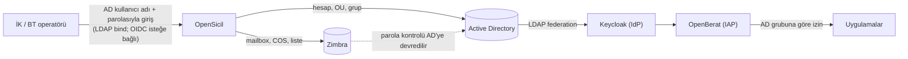
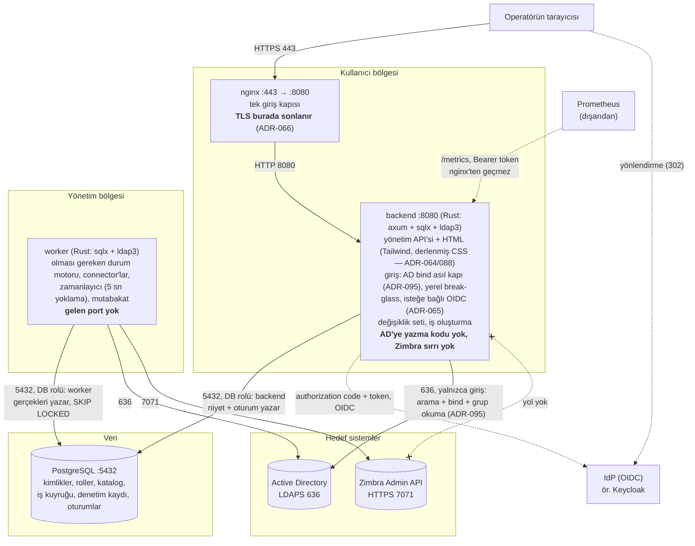
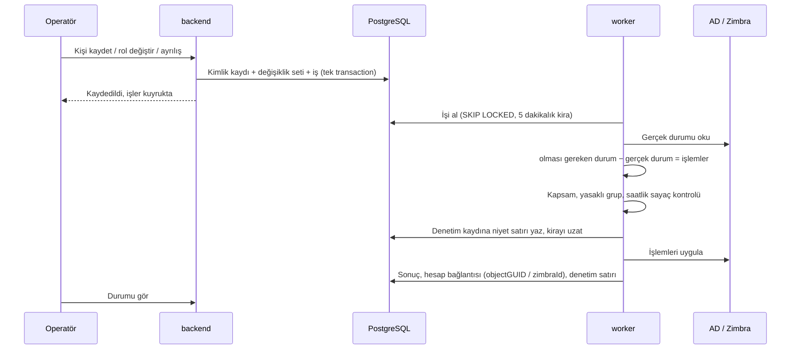
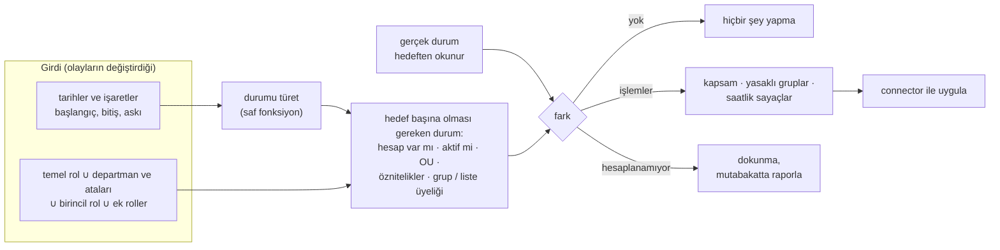
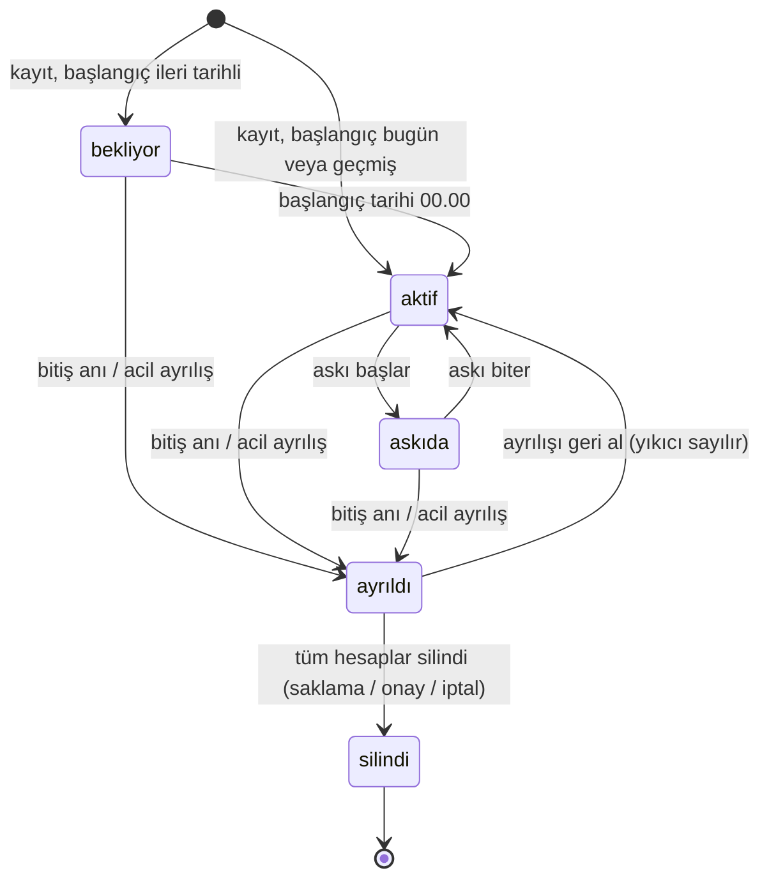

# OpenSicil

*English: [README_ENG.md](README_ENG.md)*

OpenSicil, kendi Active Directory'sini işleten kurumlar için açık kaynak bir **IGA** (kimlik yönetişimi ve yönetimi) ürünüdür. İK bir kişiyi kaydettiğinde, kişinin departmanına ve rollerine göre AD hesabını açar, doğru OU'ya yerleştirir, gruplara ekler ve Zimbra'da mailbox oluşturur. Görev değişikliğinde yetkileri günceller; ayrılışta hesapları kapatır ve saklama süresi dolunca siler.

**Hedef sahne:** Kişi işe gelir; İK adını, soyadını, kimlik numarasını, telefonunu ve birimini girer, "parolanız bu" der; kişi o dakikadan itibaren AD hesabı, grupları, mailbox'ı ve bunlardan yetki okuyan her şeyle çalışır, 60 saniyenin altında (ADR-056).

## Durum

**v1 hazır (2026-10-02): ilk beş faz tamamlandı.** Sıfırdan kurulan ya da mevcut personeli olan bir kurum ürünü Active Directory üstünde tek başına kullanabilir: kayıt, görev değişikliği, askı, planlı ve acil ayrılış, ilk parola teslimi, roller ve departman ağacı, değişiklik seti eşiği ve onayı, mutabakat raporu ve gece koşusu, CSV ile toplu içe aktarma, mevcut hesapların sahiplenilmesi ve toplu yönetime alınması, metrik ucu, Kubernetes'te çalışma. Zimbra v1'e dahil değildir (ADR-090); sırada o bölüm var. Tasarım 12 belge ve 134 karar kaydı (ADR) olarak yazıldı; her faz güvenlik ve test kapanışından geçti — güvenlik kontrol listesinde testi ya da kodu henüz olmayan maddeler `docs/07`'de açık olarak ve nedeniyle duruyor (gerçek Postgres + lab Keycloak + lab Samba AD'ye karşı testler, kapsam ≥ %90, imaj taraması, N-03 yük ölçümü 20.000 kimlikte). Kurulum: [docs/09](docs/09-kurulum.md).

**v1'den sonra eklendi:** AD'den geri dolum ve mutabakatta "AD'de farklı" listesi (ADR-112), fark listesine departman ve rol (ADR-120), kapsam köklerinin altından katalog OU keşfi (ADR-121), kayıp hesabın bağlantısının kaldırılması (ADR-122), yenilenen arayüz kabuğu (ADR-114), AD'de yapılan kişi alanı değişikliğinin 15 dakika içinde kendiliğinden gelmesi (ADR-138).

## Hangi sorunu çözer

- Hesap ve yetkiler elle, yöneticiden yöneticiye farklı açılıyor.
- Ayrılanların hesapları açık kalıyor.
- Görev değiştirenlerde yetkiler birikiyor.

## Ürün nerede duruyor

OpenSicil üç soruyu birbirinden ayırır ve yalnızca birincisini cevaplar:

| Soru | Kim cevaplar |
|---|---|
| **Bu kişi hangi sistemlerde hangi hesap ve yetkilere sahip olmalı?** | **OpenSicil** |
| Bu kişi gerçekten o kişi mi (giriş, MFA)? | IdP: Keycloak, Entra ID, AD'nin kendisi |
| Bu istek bu uygulamaya geçebilir mi? | Uygulamanın kendisi ya da OpenBerat gibi bir IAP |

OpenSicil uygulamalara doğrudan dokunmaz. Uygulama erişimi AD grubu üzerinden verilir; grubu okuyan her şey (Keycloak arkasındaki SSO, LDAP ile giriş, VPN/RADIUS, dosya paylaşımları, OpenBerat) **hiç connector olmadan** çalışır (ADR-008).

## Mimari

Dört container, tek depo, ayrı bir frontend container'ı yok. Bütün tasarım tek bir kurala dayanır: **kullanıcıya bakan bileşende AD'ye yazan tek satır kod yoktur.** Hesap açan, üyelik ve öznitelik yazan yol yalnızca worker'dadır; backend AD'ye yalnızca giriş için okur — servis hesabıyla kullanıcıyı arar, operatörün parolasıyla bind eder (ADR-095).

| Bileşen | Görev | Ağ |
|---|---|---|
| **nginx** | Tek giriş kapısı; host'ta yalnızca bu serviste port açık (443, TLS burada sonlanır — ADR-066; önünde ayrı bir proxy/Ingress varsa düz HTTP'ye alınabilir) | Dışarıya açık tek port |
| **backend** | Yönetim API'si + HTML arayüzü (Tailwind şablonları, ayrı frontend yok — ADR-064; CSS, font ve tema betiği binary'ye gömülü, dış CDN yok — ADR-088), giriş ekranı: AD bind asıl kapı (ADR-095), yerel break-glass `admin`, isteğe bağlı OIDC (ADR-065); doğrulama, değişiklik seti, iş oluşturma | nginx'ten gelen; veritabanına, giriş için AD'ye (636, yalnızca okuma) ve yapılandırılmışsa IdP'ye giden bağlantı. **AD'ye hiç yazmaz, Zimbra'ya hiç bağlanmaz** |
| **worker** | Olması gereken durumu hesaplar, farkı bulur, connector'larla uygular, zamanlanmış işleri çalıştırır | Gelen bağlantı yok. Yalnızca veritabanına, AD'ye ve Zimbra'ya giden bağlantı |
| **db** | PostgreSQL: kimlikler, roller, katalog, iş kuyruğu, denetim kaydı, operatör oturumları | Yalnızca backend ve worker |

**Neden iki süreç:** AD'de hesap açıp gruba ekleyebilen sırlar kurumun en değerli sırlarındandır. İnternete bakan bileşen bunları hiç görmezse, backend'i ele geçiren saldırgan en fazla veritabanına *niyet* yazabilir. Worker'ın *gerçeklerine* (hesap bağlantısı, katalog) yazamaz, çünkü veritabanı rolleri buna izin vermez (ADR-015); worker da bu niyeti uygulamadan önce kendi sınırlarıyla kontrol eder (ADR-014).

**Neden ayrı bir frontend yok:** Backend zaten Rust; Tailwind ile kendi HTML'ini üretir, ayrı bir Node build zinciri ya da SPA container'ı eklenmez (ADR-064). CSS tek dosyaya derlenir (Tailwind standalone CLI) ve font/tema betiğiyle birlikte binary'ye gömülür; sayfa hiçbir dış adrese istek atmaz (ADR-088). nginx yalnızca TLS'i sonlandırıp isteği backend'e geçiren bir ters proxy'dir.

**Migration:** Şema değişiklikleri, aynı imajın `migrate` alt komutuyla, şema sahibi rolüyle, tek seferlik bir container olarak çalışır — backend ve worker'ın rolleri migration çalıştıramaz (ADR-015, ADR-061).

### Veri akışı

Kayıt ile uygulama birbirinden ayrıdır. AD başarılı olup Zimbra başarısız olursa kayıt tutarlı kalır; Zimbra işi tekrar denenir ve sonunda "müdahale gerekiyor" listesine düşer.

### Olması gereken durum motoru

"İşe giriş kodu", "ayrılış kodu" ya da "rol değişikliği kodu" yoktur. Tek bir hesaplama vardır:

Olaylar yalnızca girdiyi değiştirir: işe giriş başlangıç tarihini, ayrılış bitiş anını, askı iki tarihi, rol değişikliği rol listesini. Durumun kendisi **türetilir, saklanmaz** (ADR-038). Aynı iş iki kez çalışırsa zararsızdır: ikincisi fark bulamaz. Mutabakat raporu da aynı hesaplamayı kullanır; sürüklenecek ikinci bir fark kodu yoktur.

**Ters yön de çalışır** (ADR-112, ADR-138): mutabakat 15 dakikada bir koşar. Kimlikte boş olan bir alanın AD'de değeri varsa onaysız yazılır — boş alan sahipsizdir. Dolu alanda tarama AD'nin şimdiki halini **önceki taramadaki haliyle** karşılaştırır: değişiklik yalnızca AD'de yapıldıysa (ad, soyad, sicil, cep, departman, unvan) kimliğe kendiliğinden gelir ve denetime `ad_auto` kaynağıyla girer. Aynı alan iki taramanın arasında hem AD'de hem OpenSicil'de değiştiyse ya da fark özellik devreye girmeden önce de varsa, mutabakat ekranındaki "AD'de farklı" listesinde bekler; operatör satırları seçip "AD'dekini al" der. "En yeni kazanır" kurulmaz: AD'de alan düzeyinde değişiklik zamanı yoktur, taban önceki taramadır.

### Kimlik yaşam döngüsü

| Durum | AD hesabı | AD grupları | Zimbra hesabı | Zimbra listeleri |
|---|---|---|---|---|
| **bekliyor** | Var, pasif | Rollere göre | Var, girişe kapalı, posta alır | Rollere göre |
| **aktif** | Aktif | Rollere göre | Aktif | Rollere göre |
| **askıda** | Pasif | Korunur | Girişe kapalı | Korunur |
| **ayrıldı** | Pasif; parola 7 gün sonra rastgele değiştirilir | Katalog grupları kaldırılır | Girişe kapalı | Kaldırılır |
| **silindi** | Silinir (varsayılan 90 gün) | — | Silinir (yalnızca onayla) | — |

### Dağıtım

Aynı imajlar ve tek `compose.yaml` dört topolojide çalışır (ADR-061). Topolojiyi kimlik sayısı değil, kurumun veritabanı ve ağ bölgesi düzeni seçtirir.

| Topoloji | Nerede ne çalışır | Not |
|---|---|---|
| **A. Tek sunucu** | Hepsi tek VM'de: `docker compose up -d` | Referans kurulum |
| **B. Uygulama + veritabanı** | Sunucu 1: nginx, backend, worker, tek seferlik `migrate`. Sunucu 2: kurumun PostgreSQL'i | `sslmode=verify-full` zorunlu: `sqlx` varsayılanı `prefer` sessizce düz metne düşer |
| **C. Ön yüz + worker** | Sunucu 1 (kullanıcı bölgesi): nginx, backend. Sunucu 2 (yönetim bölgesi): worker | AD ve Zimbra sırları sunucu 1'e hiç konmaz; backend/worker ayrımını güvenlik duvarı kendiliğinden sağlar |
| **D. Kubernetes** | backend: bir ya da daha çok kopya. worker: `replicas: 1`, `strategy: Recreate` | Chart yayımlanmaz; compose → Kubernetes eşlemesi [docs/09](docs/09-kurulum.md)'da |

Ürün chart yerine bir **süreç sözleşmesi** verir: SIGTERM'de elindeki işi bitirme, portsuz worker için `worker-health` komutu, sıra varsaymayan başlangıç, tek seferlik migration container'ı, süreç içinde durum olmaması, token'lı metrik ucu. Worker'ı çoğaltmak hız kazandırmaz: sınır tek yazma sırası ve saatlik sayaçlardır, ikisi de bilerek konmuştur.

## Neyi, neden, nasıl kararlaştırdık

134 kaydın tamamı geliştirme deposundaki `docs/decisions/` altındadır ve bu depoya girmez (aşağıdaki nota bakın); her kaydın bir cümlelik açıklaması [docs/PROJECT.md](docs/PROJECT.md#kararlar) içindedir. Ürünü biçimlendirenler:

### Konumlandırma

| Ne | Neden | Nasıl | ADR |
|---|---|---|---|
| OpenBerat modülü değil, bağımsız bir IGA | Kimlik yaşam döngüsü ile erişim kararı ayrı sorulardır; OpenBerat kullanmayan kurumun da aynı ihtiyacı var | Sözleşme AD grubudur: OpenSicil grubu atar, uygulama okur. İkisi birbirinin kodunu bilmez | 001, 008 |
| midPoint ya da Syncope'u ayarlamak yerine yazmak | Fark *yapılabilir* olanda değil, *küçük ve varsayılan* olandadır: tek `docker compose up`, betik dili yok, Zimbra birinci sınıf hedef, varsayılan olarak güvenli | midPoint'in kavramları ödünç alınır, kodu alınmaz. AD provisioning'den önce bir günlük midPoint denemesi planlıdır ve bir **vazgeçme tetikleyicisi** yazılıdır: gereksinimler onay akışlarına, yetki gözden geçirmeye, SoD'ye ve beşten fazla hedefe uzanırsa geliştirme durur | 002 |
| Hedef 500–5.000 kimlik | Küçük bir BT ekibinin AD ve Zimbra'yı elle işlettiği yer burasıdır | Varsayılanlar küçük kuruma uyar; eşikler 50.000 kimliğe kadar yükseltilir | 016 |

### Mimari

| Ne | Neden | Nasıl | ADR |
|---|---|---|---|
| Rust (axum + sqlx) ve PostgreSQL; iş kuyruğu bir tablo | Kuyruk veritabanında olunca kimlik kaydı ile işi **aynı transaction'da** yazılır; "kayıt oldu ama iş kayboldu" olmaz, outbox deseni ve ek servis gerekmez | `SELECT … FOR UPDATE SKIP LOCKED`, 5 saniyede bir yoklama | 003, 028 |
| backend ve worker ayrı; sırlar yalnızca worker'da | Ele geçirilen web katmanı AD'ye yazamamalı | Sırlar `.env`'den servis bazında dağıtılır; üç veritabanı rolü; hesap bağlantısı ve kataloğa yalnızca worker yazar; denetim tablosu yalnızca eklemeye açıktır ve `current_user` damgalar | 004, 006, 015 |
| Olay başına kod yerine tek bir olması gereken durum motoru | Yeni olay türü ya da yeni hedef sistem işi katlamamalı; yeniden çalıştırmak güvenli olmalı | Olması gereken durumu saf fonksiyon hesaplar; durum kolonu yoktur, tarihlerden ve işaretlerden türetilir | 004, 038, 053 |
| Motor hesaplayamadığına dokunmaz | Yeni roldeki "hesap açılsın = hayır" on yıllık mailbox'ı silmemeli; SOC'un kapattığı hesabı bir rol düzenlemesi geri açmamalı | Belirsiz bileşen atlanır ve raporlanır; etkinleştirme yalnızca durum geçişinde yapılır | 040, 032 |
| İş adım bazında değil, kimlik bazında | Sıra karışsa bile son çalışan iş doğru sonucu üretir | "Bu kimliği şu hedefte olması gereken duruma getir"; tekilleştirilir; öncelik: acil ayrılış > tek kimlik > toplu değişiklik > mutabakat | 004, 016 |
| Tek yazma sırası, ayrı okuma şeridi | Saatlik sayaçlar yarışsızdır; 30 dakikalık mutabakat acil ayrılışı bekletmez | Yazma şeridi kimlik işlerini sırayla çalıştırır; mutabakat ve katalog yenileme yanında çalışır, hedefe hiç yazmaz | 047, 051 |
| İş kirayla alınır; niyet işlemden önce yazılır | İş ortasında öldürülen worker ne işi ne denetim izini kaybetmeli | 5 dakikalık kira, yeniden alımda deneme hakkı azalmaz; her connector yazmasından önce denetim kaydına niyet satırı yazılır, yazılamıyorsa hedefe dokunulmaz | 062 |
| Zamanlayıcı olay değil sorgu çalıştırır | Worker hafta sonu kapalı kaldıysa kaçırılan geçişler kaybolmamalı | Her tikte türetilen durum uygulananla karşılaştırılır, fark için iş açılır | 028 |
| Giriş kendi ekranımızdan: AD'ye bind asıl kapı, yerel break-glass yanında, OIDC isteğe bağlı | AD'si olan kuruma ikinci bir kimlik sistemi dayatılmamalı; parola yine OpenSicil'de durmamalı | Doğrulama ve kilitleme AD'de, yetkiler AD gruplarından (OIDC ile aynı eşleme); görev ayrılığıyla altı yönetim yetkisi; ayrılmış ya da askıdaki operatörün her isteği üç kapıda da reddedilir; yerel hesap argon2id + 5 denemede 15 dk kilit | 095, 005, 019, 059 |

### Frenler (ayarla değil, varsayılan olarak güvenli)

| Ne | Neden | Nasıl | ADR |
|---|---|---|---|
| Yönetilen kapsam ve yasaklı gruplar | Kimse bir role Domain Admins'i ya da onun iç içe üyesi bir grubu ekleyememeli | Kapsam worker'ın ortam değişkenindedir; ayrıcalıklı gruplar kataloğa hiç giremez; kontrol her işlemden önce yapılır | 014 |
| Eşiği aşan düzenleme taslakta bekler | Tek yanlış rol düzenlemesi 300 kişinin VPN'ini kesmemeli ya da 3.000 kişiye bir paylaşım vermemeli | Etki önizlemesi tahmin değil, kesin model farkıdır; eşiğin üstünde (varsayılan 10 kimlik) başka bir yönetici onaylar; ekleme de sayılır; tek yöneticili kurum için zaman kilidi vardır | 031, 037, 026 |
| Saatlik sayaçlar worker'da | Onay bir backend kontrolüdür, ele geçirilmiş backend onu uydurabilir; saldırgana karşı fren worker'da durmalıdır | Üç sayaç (yıkıcı, verme, ilk parola; varsayılan saatte 50); iş sayaçlara karşı bütündür; önce ekleme, sonra çıkarma | 016, 050 |
| Mevcut hesapları sahiplenme gözlem modunda başlar | Mevcut personel ilk gün kesinti yaşamamalı | Varsayılan kapalı; worker'da doğrulanır; hesap yönetime alınana kadar motor farkı gösterir, uygulamaz | 018 |
| Kuru çalıştırma modu | İlk kurulum, sürüm yükseltme ve yedekten dönüş prova ister | Connector yazmaları tek noktada kesilir; işler "uygulanacaktı" diye kaydeder | 054 |

### Kişisel veri, parola, adlar

| Ne | Neden | Nasıl | ADR |
|---|---|---|---|
| Hiçbir yerde parola alanı yok | OpenSicil parola kasası olmamalı | İlk parolayı worker üretir, AEAD ile şifreler, bir kez gösterir, en geç 10 dakikada siler; yalnızca hiç giriş yapılmamış hesaba (`lastLogonTimestamp` boş). Zimbra parolayı AD'de doğrular, tek parola vardır | 009, 036, 046 |
| Kimlik numarası şifreli | Kaybolan yedek diski onu sızdırmamalı | Uygulama katmanında şifreleme; tekillik ve arama için blind index; ekranda maskeli; her görüntüleme denetime yazılır; log, URL, kuyruk ve denetim değerlerinde hiç yer almaz | 010 |
| Kullanıcı adı ve e-posta değişmez, tekrar kullanılmaz | Yeni gelen, ayrılanın postasını almamalı | Şablon ve sabit normalleştirme; yöneticinin serbest bırakabildiği kullanılmış ad kaydı | 011, 035 |
| Betik dili olmadan öznitelik eşleme | AD yöneticisi Groovy öğrenmek zorunda kalmamalı; ayar kod çalıştırma yüzeyi olmamalı | Sabit dönüşümler; eşlenebilir hedef öznitelikler kodda sabit izinli listedir; `sAMAccountName` ve UPN eşlenemez | 012, 029, 034 |

### Yaşam döngüsü

| Ne | Neden | Nasıl | ADR |
|---|---|---|---|
| Önce pasifleştir, saklama süresi dolunca sil | Unutulmuş eski hesap geç açılmış yeni hesaptan daha tehlikelidir, ama silme geri alınamaz | Saklama hedef sistem başınadır: AD 90 gün; Zimbra mailbox'ı yalnızca onayla silinir | 013, 024 |
| Ayrılanın parolası 7 gün sonra rastgele değiştirilir | İlk hafta içindeki geri alma parola sıfırlama gerektirmemeli | Acil ayrılışta hemen | 033 |
| Ayrılanın kendi posta yönlendirmesi ve filtreleri temizlenir | Ayrılmadan önce postasını kişisel adresine yönlendiren kişi, kilitli hesaptan kurumsal postayı almaya devam eder | Ayrılış anında temizlenir ve hesap bağlantısında saklanır; otomatik yanıt 24 saat sonra yazılır | 045, 049 |
| Kayıt iptali hedefte doğrulanır | Tek yanlış tık, sahiplenilmiş on yıllık hesabı saklamasız silmemeli | Yalnızca OpenSicil'in açtığı ve hiç kullanılmamış hesap silinir; aksi halde planlı ayrılış gibi uygulanır | 048 |
| Ayrılan yöneticinin astları yeniden yazılmaz, türetilir | Her astı yeniden yazmak kendi hata biçimleri olan bir toplu değişikliktir | Devir yöneticisi ayrılanın kaydında durur; astların etkin yöneticisi hesaplanır | 041 |

### Bilerek yazılmayanlar

İhtiyaç kanıtlanınca eklenir; önceden yazılırsa yalnızca bakım yükü getirir.

- Ayrı bir mesaj kuyruğu servisi (RabbitMQ, Kafka). Kuyruk PostgreSQL'de.
- Eklenti yükleme altyapısı. Connector'lar kodun içinde.
- Genel amaçlı kural / ifade dili ya da betik çalıştırma.
- İş akışı (BPMN) motoru. v1'deki tek onay adımı toplu değişiklik frenidir.
- Kendi IdP'miz ya da parola kasası.
- SSO, erişim kararı, PAM, yetki gözden geçirme kampanyaları: başka ürünlerin işi, kalıcı olarak kapsam dışı.

## Yol haritası

Her faz atlanamayan bir güvenlik ve test kapanışıyla biter ([docs/08](docs/08-gereksinimler.md#önerilen-faz-sırası); oradaki numaralandırma tarihsel sırayı, aşağıdaki liste uygulanan sırayı gösterir — Zimbra ADR-090 ile v1'den sonraya alındı).

1. ✅ **Altyapı** — iskelet ve süreç sözleşmesi, giriş (önce OIDC; sonra ADR-095 ile AD bind asıl kapı oldu), kod olarak Samba AD + Keycloak lab'ı (midPoint denemesi burada yapıldı)
2. ✅ **Kayıt ve model** — veritabanı rolleri, kimlik, departman ağacı, roller, katalog, denetim kaydı, saf modül olarak olması gereken durum fonksiyonu
3. ✅ **AD provisioning** — motor ve kuyruk, roller ve adlar, yaşam döngüsü, ilk parola, gözlem modunda sahiplenme, fren ve onay
4. ✅ **İşletme** — okuma şeridi, mutabakat raporu, saklama, metrikler, kuru çalıştırma
5. ✅ **Mevcut kurum** — CSV içe aktarma ve toplu sahiplenme. **v1 burada hazır oldu.**
6. ⬜ **Zimbra** — lab keşfi, connector, COS ve liste kataloğu, yaşam döngüsü karşılıkları; mutabakat, metrik, sahiplenme ve CSV'nin Zimbra'yı kapsayacak şekilde genişlemesi

## Belge haritası

| Dosya | İçerik |
|---|---|
| [docs/PROJECT.md](docs/PROJECT.md) | Amaç, v1 kapsamı, kapsam dışı, açıklamalı karar listesi |
| [docs/00](docs/00-kavramlar.md) · [01](docs/01-mevcut-cozumler.md) | Kavramlar · mevcut ürünler ve yeniden icat etmediklerimiz |
| [docs/02](docs/02-mimari.md) · [03](docs/03-rol-ve-veri-modeli.md) · [04](docs/04-yasam-dongusu.md) | Mimari · rol ve veri modeli · yaşam döngüsü |
| [docs/05](docs/05-active-directory.md) · [06](docs/06-zimbra.md) | Active Directory · Zimbra |
| [docs/07](docs/07-guvenlik-ve-kvkk.md) · [08](docs/08-gereksinimler.md) · [09](docs/09-kurulum.md) | Tehdit modeli ve kişisel veri · gereksinimler ve fazlar · kurulum ve dağıtım |
| [docs/10](docs/10-saha-notlari.md) · [11](docs/11-dogrulama-notlari.md) | Gerçek kurumdan saha notları · birincil kaynak doğrulaması |

> **Karar kayıtları (ADR 001–132) bu depoda yer almaz.** Geliştirme sürecinin kendi kaydıdır ve geliştirme deposunda kalır; metindeki `ADR-NNN` numaraları izlenebilirlik için duruyor, her birinin bir cümlelik açıklaması [docs/PROJECT.md](docs/PROJECT.md#kararlar) içindedir.
