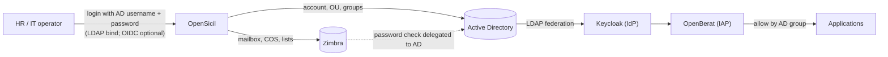
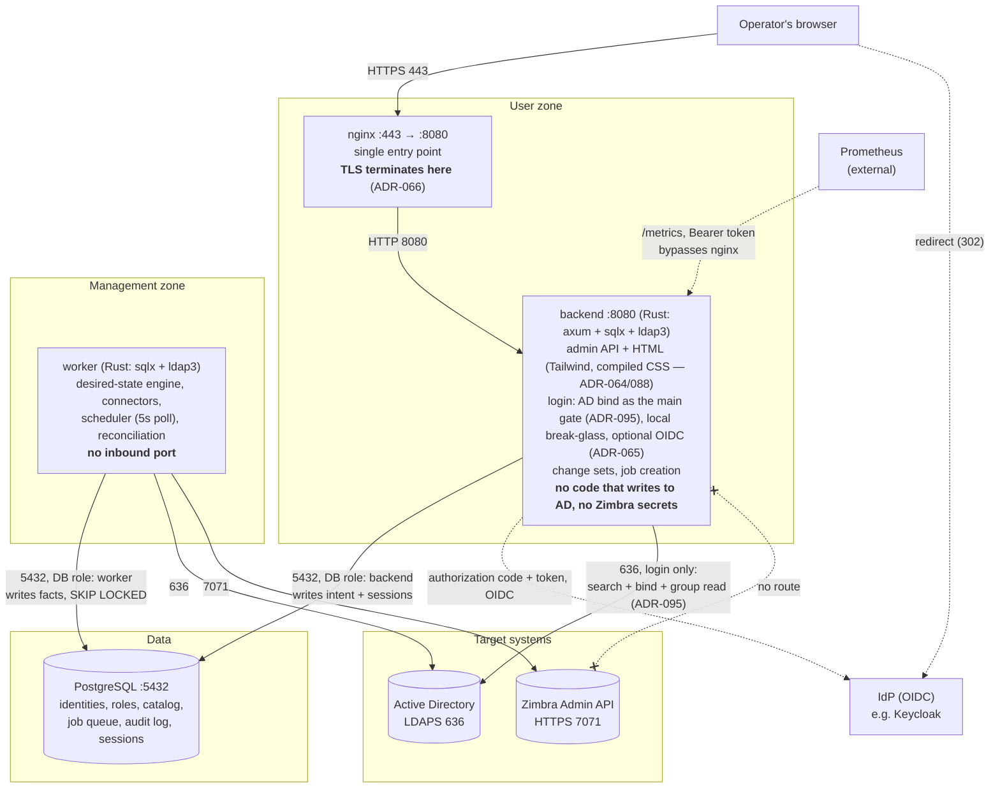
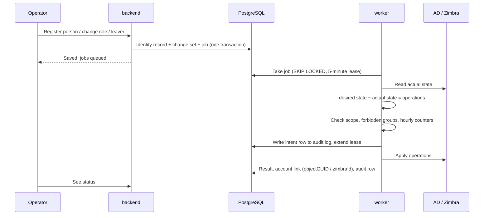
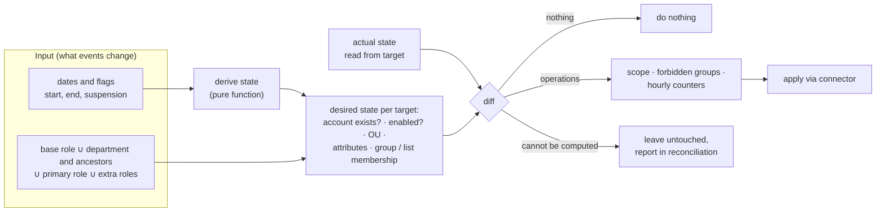
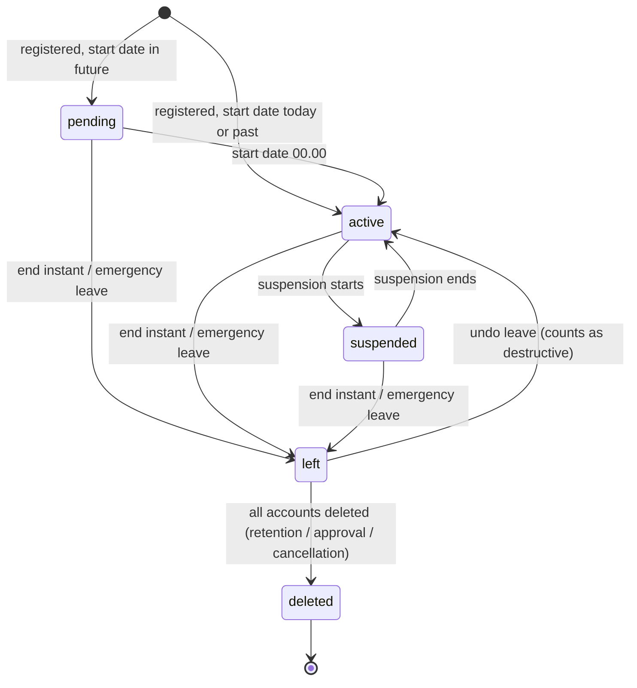

# OpenSicil

*Türkçe: [README.md](README.md)*

OpenSicil is an open-source **IGA** (Identity Governance & Administration) product for organisations that run their own Active Directory. When HR registers a person, OpenSicil creates the AD account, places it in the right OU, adds it to groups and creates the Zimbra mailbox, all derived from the person's department and roles. When the person changes jobs it updates the entitlements; when they leave it disables the accounts and deletes them after the retention period.

**Target scene:** the person arrives on day one; HR types name, surname, ID number, phone and department, says "this is your password", and from that minute the person works with an AD account, groups, a mailbox and everything that reads authorisation from them, in under 60 seconds ([ADR-056](docs/decisions/056-ise-baslama-gunu-akisi.md)).

## Status

**Design phase. There is no application code yet.** The design is written down as 12 design documents and 62 decision records (ADRs), reviewed several times from the viewpoint of an HR operator, an IGA architect and an operator on call, and 56 technical claims were checked against primary sources (Zimbra and Samba source code, Microsoft protocol documents, `ldap3`, Keycloak); four turned out wrong and were corrected ([ADR-057](docs/decisions/057-birincil-kaynak-dogrulamasi.md), [docs/11](docs/11-dogrulama-notlari.md)). The next step is the skeleton (Phase 1a).

The documentation under `docs/` is in Turkish. This README is the English entry point.

## What problem it solves

- Accounts and permissions are opened by hand, differently by each administrator.
- Leavers' accounts stay open.
- People who change jobs accumulate permissions.

## Where the product sits

OpenSicil separates three questions and answers only the first one:

| Question | Who answers |
|---|---|
| **Which accounts and entitlements should this person have, in which systems?** | **OpenSicil** |
| Is this person really who they claim to be (login, MFA)? | The IdP: Keycloak, Entra ID, AD itself |
| May this request reach this application? | The application itself, or an IAP such as OpenBerat |

OpenSicil never touches applications directly. Application access is granted through AD groups, so anything that reads groups (SSO behind Keycloak, LDAP logins, VPN/RADIUS, file shares, OpenBerat) works with **no connector at all** ([ADR-008](docs/decisions/008-uygulama-yetkileri-ad-gruplari.md)).

## Architecture

Four containers, one repository, no separate frontend container. The whole design hangs on one rule: **the component that faces users contains not a single line of code that writes to AD.** Creating accounts and writing memberships or attributes happens only in the worker; the backend reads AD only to log operators in — it looks the user up with the service account and binds with the operator's password ([ADR-095](docs/decisions/095-giris-kendi-ekranimiz-ad-bind-asil.md)).

| Component | Job | Network |
|---|---|---|
| **nginx** | Single entry point; the only service with a published host port (443, TLS terminates here — [ADR-066](docs/decisions/066-tls-nginxte-sonlanir.md); switches to plain HTTP if a proxy/Ingress sits in front) | The only published port |
| **backend** | Admin API + HTML UI (Tailwind templates, no separate frontend — [ADR-064](docs/decisions/064-frontend-htmx-tailwind.md); CSS, font and theme script embedded in the binary, no external CDN — ADR-088), login screen: AD bind as the main gate ([ADR-095](docs/decisions/095-giris-kendi-ekranimiz-ad-bind-asil.md)), local break-glass `admin`, optional OIDC ([ADR-065](docs/decisions/065-oidc-akisi-backend.md)); validation, change sets, job creation | Inbound from nginx; outbound to the database, to AD for login only (636, read-only) and to the IdP when configured. **Never writes to AD, never connects to Zimbra** |
| **worker** | Computes the desired state, finds the diff, applies it through connectors, runs scheduled work | No inbound connections. Outbound to the database, AD and Zimbra only |
| **db** | PostgreSQL: identities, roles, catalog, job queue, audit log, operator sessions | backend and worker only |

**Why two processes:** credentials that can create accounts and add them to groups are among the most valuable secrets an organisation has. If the internet-facing component never sees them, an attacker who takes over the backend can at most write *intent* into the database. They cannot write the worker's *facts* (account links, catalog), because the database roles forbid it ([ADR-015](docs/decisions/015-veritabani-rolleri.md)), and the worker checks that intent against its own limits before acting ([ADR-014](docs/decisions/014-yonetim-kapsami-ve-toplu-degisiklik-freni.md)).

**Why there is no separate frontend:** the backend is already Rust; it renders its own HTML with Tailwind instead of adding a Node build chain or an SPA container ([ADR-064](docs/decisions/064-frontend-htmx-tailwind.md)). The CSS is compiled into a single file (Tailwind standalone CLI) and embedded in the binary together with the font and the theme script; the page makes no external requests ([ADR-088](docs/decisions/088-arayuz-kabugu-derlenmis-css-tema-font.md)). nginx is just a reverse proxy that terminates TLS and forwards to the backend.

**Migration:** schema changes run as the same image's `migrate` subcommand, under the schema-owner role, as a one-shot container — the backend and worker roles cannot run migrations ([ADR-015](docs/decisions/015-veritabani-rolleri.md), [ADR-061](docs/decisions/061-dagitim-sozlesmesi-compose-ve-kubernetes.md)).

### Data flow

Recording and applying are separate. If AD succeeds and Zimbra fails, the record stays consistent; the Zimbra job is retried and finally lands in a "needs attention" list.

### The desired-state engine

There is no "joiner code", "leaver code" or "role change code". There is one computation:

Events only change the input: a joiner sets a start date, a leaver sets an end instant, a suspension sets two dates, a role change edits the role list. The state itself is **derived, never stored** ([ADR-038](docs/decisions/038-kimlik-durumu-turetilir.md)). Running the same job twice is harmless: the second run finds no diff. The reconciliation report uses the very same computation, so there is no second diff implementation to drift.

### Identity lifecycle

| State | AD account | AD groups | Zimbra account | Zimbra lists |
|---|---|---|---|---|
| **pending** | Exists, disabled | Per roles | Exists, login closed, receives mail | Per roles |
| **active** | Enabled | Per roles | Active | Per roles |
| **suspended** | Disabled | Kept | Login closed | Kept |
| **left** | Disabled; password randomised after 7 days | Catalog groups removed | Login closed | Removed |
| **deleted** | Deleted (default: 90 days) | — | Deleted (only with approval) | — |

### Deployment

The same images and one `compose.yaml` run in four topologies ([ADR-061](docs/decisions/061-dagitim-sozlesmesi-compose-ve-kubernetes.md)). The topology is chosen by the organisation's database and network-zone layout, not by identity count.

| Topology | What runs where | Note |
|---|---|---|
| **A. Single server** | Everything on one VM: `docker compose up -d` | Reference install |
| **B. App + database** | Server 1: nginx, backend, worker, one-shot `migrate`. Server 2: the organisation's PostgreSQL | `sslmode=verify-full` is mandatory: the `sqlx` default `prefer` silently falls back to plaintext |
| **C. Front + worker** | Server 1 (user zone): nginx, backend. Server 2 (management zone): worker | AD and Zimbra secrets are never placed on server 1; the firewall gives the backend/worker split for free |
| **D. Kubernetes** | backend: one or more replicas. worker: `replicas: 1`, `strategy: Recreate` | No chart is published; [docs/09](docs/09-kurulum.md) maps compose to Kubernetes |

Instead of a chart the product ships a **process contract**: finish the job in hand on SIGTERM, a `worker-health` command for the port-less worker, start-up that assumes no ordering, a one-shot migration container, no in-process state, a token-protected metrics endpoint. Scaling the worker out buys no speed: the limits are the single write lane and the hourly counters, and both are deliberate.

## What we decided, why, and how

All 62 records live in [docs/decisions/](docs/decisions/); the annotated list is in [docs/PROJECT.md](docs/PROJECT.md#kararlar). The ones that shape the product:

### Positioning

| What | Why | How | ADR |
|---|---|---|---|
| A standalone IGA, not a module of OpenBerat | Identity lifecycle and access decisions are different questions; organisations without OpenBerat have the same need | The AD group is the contract: OpenSicil assigns the group, the application reads it. Neither knows the other's code | [001](docs/decisions/001-kapsam-ve-konumlandirma.md), [008](docs/decisions/008-uygulama-yetkileri-ad-gruplari.md) |
| Build instead of configuring midPoint or Syncope | The difference is not what is *possible* but what is *small and default*: one `docker compose up`, no scripting language, Zimbra as a first-class target, safe by default | midPoint's concepts are borrowed, not its code. A one-day midPoint trial is scheduled before AD provisioning, and an **abandonment trigger** is written down: if requirements grow into approval workflows, access reviews, SoD and more than five targets, development stops | [002](docs/decisions/002-hazir-urun-yerine-gelistirme.md) |
| Aim at 500–5,000 identities | That is where a small IT team runs AD and Zimbra by hand | Defaults fit small organisations; thresholds are raised up to 50,000 identities | [016](docs/decisions/016-hedef-olcek-ve-olcekte-calisma.md) |

### Architecture

| What | Why | How | ADR |
|---|---|---|---|
| Rust (axum + sqlx) and PostgreSQL; the job queue is a table | With the queue in the database, the identity record and its job are written **in the same transaction**; "saved but the job got lost" cannot happen, and no outbox pattern or extra service is needed | `SELECT … FOR UPDATE SKIP LOCKED`, polled every 5 seconds | [003](docs/decisions/003-stack-rust-postgresql.md), [028](docs/decisions/028-worker-zamanlamasi.md) |
| backend and worker are separate; secrets live only in the worker | A compromised web tier must not be able to write to AD | Per-service `.env` distribution; three database roles; only the worker writes account links and the catalog; the audit table is insert-only and stamps `current_user` | [004](docs/decisions/004-mimari-web-ve-worker.md), [006](docs/decisions/006-sirlar-env.md), [015](docs/decisions/015-veritabani-rolleri.md) |
| One desired-state engine instead of per-event code | A new event type or a new target system must not multiply the work; re-running must be safe | A pure function computes the desired state; the state column does not exist, it is derived from dates and flags | [004](docs/decisions/004-mimari-web-ve-worker.md), [038](docs/decisions/038-kimlik-durumu-turetilir.md), [053](docs/decisions/053-tarihli-aski.md) |
| The engine does not touch what it cannot compute | "Create account = no" on a new role must not delete a ten-year-old mailbox; an account disabled by the SOC must not be re-enabled by a role edit | Uncertain components are skipped and reported; enabling happens only on a state transition | [040](docs/decisions/040-motor-belirsiz-degere-dokunmaz.md), [032](docs/decisions/032-elle-pasiflestirme-korunur.md) |
| Jobs are per identity, not per step | If the order gets mixed up, the last job to run still produces the right result | "Bring this identity to its desired state in this target"; deduplicated; priority: emergency leave > single identity > bulk change > reconciliation | [004](docs/decisions/004-mimari-web-ve-worker.md), [016](docs/decisions/016-hedef-olcek-ve-olcekte-calisma.md) |
| One write lane, a separate read lane | Hourly counters are race-free; a 30-minute reconciliation never delays an emergency leave | The write lane runs identity jobs serially; reconciliation and catalog refresh run beside it and never write to a target | [047](docs/decisions/047-worker-tek-sirada.md), [051](docs/decisions/051-okuma-seridi.md) |
| Jobs are leased; intent is written before acting | A worker killed mid-job must lose neither the job nor the audit trail | 5-minute lease, no retry consumed on re-take; the audit intent row is written before every connector write, and if it cannot be written the target is not touched | [062](docs/decisions/062-is-kirasi-ve-yarida-kalan-is.md) |
| The scheduler runs queries, not events | If the worker was down over a weekend, missed transitions must not be lost | Every tick compares derived state with applied state and opens jobs for the difference | [028](docs/decisions/028-worker-zamanlamasi.md) |
| Our own login screen: AD bind as the main gate, a local break-glass account beside it, OIDC optional | An organisation that already has AD must not be forced into a second identity system; passwords must still never live in OpenSicil | Verification and lockout happen in AD, permissions come from AD groups (the same mapping as OIDC); six admin permissions with separation of duties; a departed or suspended operator is rejected on every request at all three gates; the local account uses argon2id and locks for 15 minutes after 5 failures | [095](docs/decisions/095-giris-kendi-ekranimiz-ad-bind-asil.md), [005](docs/decisions/005-yonetim-girisi-oidc.md), [019](docs/decisions/019-ilk-parola-teslimi.md), [059](docs/decisions/059-netlestirmeler-operator-geri-alma-aski-bitisi-accountexpires.md) |

### Brakes (safe by default, not by configuration)

| What | Why | How | ADR |
|---|---|---|---|
| Managed scope and forbidden groups | Nobody may add Domain Admins, or a group nested inside it, to a role | Scope lives in the worker's environment; privileged groups can never enter the catalog; checked before every operation | [014](docs/decisions/014-yonetim-kapsami-ve-toplu-degisiklik-freni.md) |
| Over-threshold edits wait as a draft | One wrong role edit must not cut VPN for 300 people, or hand a share to 3,000 | Impact preview is an exact model diff, not an estimate; above the threshold (default 10 identities) a different administrator approves; grants count too; a time lock covers single-admin organisations | [031](docs/decisions/031-degisiklik-seti-sahneleme.md), [037](docs/decisions/037-esik-ekleme-islemlerini-sayar.md), [026](docs/decisions/026-degisiklik-seti-onayinda-zaman-kilidi.md) |
| Hourly counters in the worker | Approval is a backend check and a compromised backend can forge it; the brake against an attacker has to sit in the worker | Three counters (destructive, grant, first password; default 50/hour); a job is atomic against the counters; adds before removes | [016](docs/decisions/016-hedef-olcek-ve-olcekte-calisma.md), [050](docs/decisions/050-verme-sayaci-ve-is-butunlugu.md) |
| Adopting existing accounts starts in observe mode | Existing staff must not have an outage on day one | Off by default; verified in the worker; the engine shows the diff but does not apply it until the account is taken under management | [018](docs/decisions/018-ice-aktarma-ve-sahiplenme.md) |
| Dry-run mode | First install, upgrades and restore-from-backup need a rehearsal | Connector writes are cut at a single point; jobs record "would have applied" | [054](docs/decisions/054-kuru-calistirma-ve-yedekten-donus.md) |

### Personal data, passwords, names

| What | Why | How | ADR |
|---|---|---|---|
| No password field anywhere | OpenSicil must not be a password vault | The worker generates the first password, encrypts it with AEAD, shows it once, deletes it after at most 10 minutes; only for an account that has never logged in (`lastLogonTimestamp` empty). Zimbra verifies passwords against AD, so there is one password | [009](docs/decisions/009-parola-yonetimi.md), [036](docs/decisions/036-ilk-parola-aead.md), [046](docs/decisions/046-kullanilmamis-hesap-lastlogontimestamp.md) |
| National ID number encrypted | A lost backup disk must not leak it | Application-level encryption plus a blind index for uniqueness and search; masked on screen; every reveal is audited; never in logs, URLs, the queue or audit values | [010](docs/decisions/010-kisisel-veri-kimlik-no-telefon.md) |
| Usernames and e-mail addresses are immutable and never reused | A newcomer must not receive a leaver's mail | Template plus fixed normalisation; a used-name registry that an administrator can release | [011](docs/decisions/011-kullanici-adi-ve-eposta.md), [035](docs/decisions/035-kullanilmis-ad-duz-metin-serbest-birakma.md) |
| Attribute mapping without a scripting language | An AD admin should not have to learn Groovy, and configuration must not be a code-execution surface | Fixed transforms; mappable target attributes are a hard-coded allow-list; `sAMAccountName` and UPN are not mappable | [012](docs/decisions/012-oznitelik-esleme.md), [029](docs/decisions/029-esleme-hedef-oznitelikleri-izinli-liste.md), [034](docs/decisions/034-sam-upn-esleme-disi-ve-bossa-yaz.md) |

### Lifecycle

| What | Why | How | ADR |
|---|---|---|---|
| Disable first, delete after retention | A forgotten old account is more dangerous than a late new one, but deletion is irreversible | Retention is per target system: AD 90 days; a Zimbra mailbox is deleted only with approval | [013](docs/decisions/013-yasam-dongusu.md), [024](docs/decisions/024-hedef-sistem-basina-saklama-suresi.md) |
| Leaver's password is randomised after 7 days | An undo within the first week should not need a password reset | Immediately on emergency leave | [033](docs/decisions/033-ayrilista-parola-gecikmesi.md) |
| Leaver's own mail forwarding and filters are cleared | Someone who forwarded mail to a private address before leaving keeps receiving corporate mail from a locked account | Cleared at the leave instant and kept on the account link; auto-reply is written 24 hours later | [045](docs/decisions/045-ayrilan-postasi-yonlendirme.md), [049](docs/decisions/049-ayrilan-postasi-kullanici-yonlendirmesi-ve-gecikme.md) |
| Cancelling a registration is verified on the target | One wrong click must not delete an adopted, ten-year-old account without retention | Only an account that OpenSicil opened and nobody has used is deleted; otherwise it is handled as a planned leave | [048](docs/decisions/048-kayit-iptali-hedefte-dogrulanir.md) |
| A departed manager's reports are derived, not rewritten | Rewriting every subordinate is a bulk change with its own failure modes | The handover manager is stored on the leaver; the subordinates' effective manager is computed | [041](docs/decisions/041-astlarin-yoneticisi-turetilir.md) |

### Deliberately not built

Added only when the need is proven; written earlier they are just maintenance load.

- A separate message broker (RabbitMQ, Kafka). The queue is in PostgreSQL.
- A plugin loader. Connectors are part of the code.
- A general rule / expression language or script execution.
- A workflow (BPMN) engine. The only approval step in v1 is the bulk-change brake.
- An IdP or password vault of our own.
- SSO, access decisions, PAM, access-review campaigns: other products' job, permanently out of scope.

## Roadmap

Every phase ends with a security-and-test closing box that cannot be skipped ([docs/08](docs/08-gereksinimler.md#önerilen-faz-sırası)).

1. **Infrastructure** — skeleton and process contract, login (OIDC first; later [ADR-095](docs/decisions/095-giris-kendi-ekranimiz-ad-bind-asil.md) made AD bind the main gate), Samba AD + Keycloak lab as code (the midPoint trial happens here), Zimbra discovery
2. **Records and model** — database roles, identities, department tree, roles, catalog, audit log, the desired-state function as a pure module
3. **AD provisioning** — engine and queue, roles and names, lifecycle, first password, adoption in observe mode, brakes and approval
4. **Zimbra** — connector, COS and list catalog, lifecycle counterparts
5. **Operations** — read lane, reconciliation report, retention, metrics, dry run
6. **Existing organisation** — CSV import and bulk adoption

## Documentation map

| File | Content |
|---|---|
| [docs/PROJECT.md](docs/PROJECT.md) | Purpose, v1 scope, out of scope, annotated decision list |
| [docs/00](docs/00-kavramlar.md) · [01](docs/01-mevcut-cozumler.md) | Concepts · existing products and what we do not reinvent |
| [docs/02](docs/02-mimari.md) · [03](docs/03-rol-ve-veri-modeli.md) · [04](docs/04-yasam-dongusu.md) | Architecture · role and data model · lifecycle |
| [docs/05](docs/05-active-directory.md) · [06](docs/06-zimbra.md) | Active Directory · Zimbra |
| [docs/07](docs/07-guvenlik-ve-kvkk.md) · [08](docs/08-gereksinimler.md) · [09](docs/09-kurulum.md) | Threat model and personal data · requirements and phases · installation and deployment |
| [docs/10](docs/10-saha-notlari.md) · [11](docs/11-dogrulama-notlari.md) | Field notes from a real organisation · primary-source verification |
| [docs/decisions/](docs/decisions/) | ADRs 001–062 |
