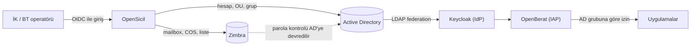
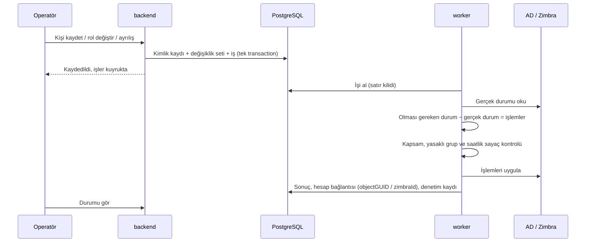

# 02 — Mimari

## Ürün nerede duruyor

OpenSicil üç soruyu birbirinden ayırır ve sadece birincisini cevaplar:

| Soru | Kim cevaplar |
|---|---|
| **Bu kişi hangi sistemlerde hangi hesap ve yetkilere sahip olmalı?** | **OpenSicil** |
| Bu kişi gerçekten o kişi mi (giriş, MFA)? | IdP: Keycloak, Entra ID, AD'nin kendisi |
| Bu istek bu uygulamaya geçebilir mi? | Uygulamanın kendisi veya OpenBerat gibi bir IAP |



OpenSicil uygulamalara doğrudan dokunmaz. Uygulama erişimi AD grubu üzerinden verilir ([ADR-008](decisions/008-uygulama-yetkileri-ad-gruplari.md)). OpenBerat bu desenin bir örneğidir, ön koşulu değildir.

## Bileşenler

| Bileşen | Görev | Ağ |
|---|---|---|
| **nginx** | Tek giriş kapısı, TLS, statik dosyalar | Dışarıya açık tek port |
| **backend** | Yönetim API'si, OIDC oturumu, doğrulama, değişiklik kaydı, iş oluşturma | Sadece nginx ve veritabanı. **AD'ye ve Zimbra'ya hiç bağlanmaz** |
| **worker** | Olması gereken durumu hesaplar, farkı bulur, connector'larla uygular, zamanlanmış işleri çalıştırır | Gelen bağlantı yok. Sadece veritabanına, AD'ye ve Zimbra'ya giden bağlantı |
| **db** | PostgreSQL: kimlikler, roller, katalog, iş kuyruğu, denetim kaydı | Sadece backend ve worker |

Stack: Rust (axum + sqlx) ve PostgreSQL ([ADR-003](decisions/003-stack-rust-postgresql.md)). Backend ve worker aynı kod tabanından iki ayrı container olarak çalışır ([ADR-004](decisions/004-mimari-web-ve-worker.md)). Frontend yaklaşımı kurulumda kararlaştırılır.

**Neden iki container:** AD'de hesap açıp gruba ekleyebilen sırlar kurumun en değerli sırlarındandır. İnternete bakan bileşen bunları hiç görmezse, backend ele geçirildiğinde saldırgan en fazla veritabanına "niyet" yazabilir. Hesap bağlantısı ve katalog gibi worker'ın gerçeklerine yazamaz ([ADR-015](decisions/015-veritabani-rolleri.md)). Worker bu niyeti kendi sınırlarıyla kontrol eder ([ADR-014](decisions/014-yonetim-kapsami-ve-toplu-degisiklik-freni.md)).

## Veri akışı



Kayıt ile uygulama birbirinden ayrıdır. AD başarılı olup Zimbra başarısız olursa kayıt tutarlı kalır. Zimbra işi tekrar denenir ve sonunda başarısız kalırsa "müdahale gerekiyor" listesine düşer.

## Olması gereken durum motoru

OpenSicil'de "işe giriş kodu", "ayrılış kodu" ya da "rol değişikliği kodu" yoktur. Tek bir hesaplama vardır:

```
kimlik (tarihler ve işaretlerden türetilen durum, departman, birincil rol, süresi dolmamış ek roller)
  + temel rol + departman + roller
  → her hedef sistem için olması gereken durum
      hesap var mı · aktif mi · OU · öznitelikler · grup/liste üyelikleri
```

Worker bir kimlik için her çalıştığında aynı üç adımı izler:

1. Olması gereken durumu hesapla (saf fonksiyon, yan etkisi yok).
2. Hedef sistemden gerçek durumu oku.
3. Farkı işlemlere çevir ve uygula.

Olaylar yalnızca girdiyi değiştirir: işe giriş başlangıç tarihini, ayrılış bitiş anını, askı iki tarihi ([ADR-053](decisions/053-tarihli-aski.md)), rol değişikliği rol listesini; durum bunlardan türetilir, saklanmaz ([ADR-038](decisions/038-kimlik-durumu-turetilir.md)). Yeni bir olay türü ya da yeni bir hedef sistem eklemek bu yüzden işi katlamaz. Aynı iş iki kez çalışırsa ikincisi fark bulamaz ve hiçbir şey yapmaz. Mutabakat raporu da aynı hesaplamayı kullanır ([docs/04](04-yasam-dongusu.md)).

Tek istisna etkinleştirmedir: motor hesabı yalnızca kimlik durumu geçiş yaptığında açar; hedefte elle pasifleştirilmiş bir hesabı sapma diye geri açmaz ([ADR-032](decisions/032-elle-pasiflestirme-korunur.md)).

Hesaplanamayan bileşen **belirsiz**dir ve dokunulmaz: rolün "hesap açılsın = hayır" demesi mevcut hesabı silmez, hedefte bulunamayan bağlı hesap yeniden açılmaz, bu hedefte hesabı olmayan yöneticinin `manager` özniteliği temizlenmez. Diğer bileşenler uygulanır, mutabakat bilgi bulgusu yazar ([ADR-040](decisions/040-motor-belirsiz-degere-dokunmaz.md)).

## İş kuyruğu

- Kuyruk ayrı bir servis değildir, PostgreSQL'de bir tablodur. Worker işi satır kilidiyle (`SKIP LOCKED`) ve **5 dakikalık kirayla** alır; iş boyunca transaction açık tutulmaz. Worker iş ortasında ölürse kira dolar, iş deneme hakkı azalmadan yeniden alınır; ikinci bir worker çalışsa bile aynı iş iki kez alınmaz ([ADR-062](decisions/062-is-kirasi-ve-yarida-kalan-is.md)).
- İş, **kimlik bazındadır**: "bu kimliği şu hedef sistemde olması gereken duruma getir". "Şu gruba ekle" gibi tek adımlık işler kuyruğa yazılmaz. Böylece sıra karışsa bile son çalışan iş doğru sonucu üretir.
- **Tekilleştirme:** Aynı kimlik ve hedef sistem için bekleyen iş varken yenisi açılmaz. Temel rol iki kez düzenlenirse kuyruk iki katına çıkmaz. Onay bekleyen değişiklik seti için iş açılmaz; taslak yayımlanınca açılır ([ADR-031](decisions/031-degisiklik-seti-sahneleme.md)).
- **Öncelik:** acil ayrılış > tek kimlik işlemi > toplu değişiklik seti > mutabakat. 2.000 kimliklik bir rol değişikliği sürerken o gün işe başlayan kişinin işi beklemez.
- Worker iki şeritlidir. **Yazma şeridi** kimlik işlerini **tek sırada** çalıştırır; saatlik sayaçlar bu yüzden yarışsızdır. **Okuma şeridi** (mutabakat, katalog yenileme, toplu yönetime almanın fark hesabı) ayrı bir görevde çalışır, hedefe yazmaz, sayaca dokunmaz; 30 dakikalık bir mutabakat acil ayrılışı bekletmez. v1'de eşzamanlılık ayarı yoktur; N-03 ölçümü (2026-10-02, lab Samba'da 20.000 hesap) tek sıranın yettiğini gösterdi — 2.000 kimliklik set 5 dk, mutabakat 8 sn, set sürerken tek kimlik işi 1 sn — ve ayar açılmadı ([ADR-047](decisions/047-worker-tek-sirada.md), [ADR-051](decisions/051-okuma-seridi.md), [ADR-108](decisions/108-n03-olcumu-tek-sira-yetti.md)).
- **Önce yaz, sonra uygula:** her connector yazma işleminden önce denetim tablosuna niyet satırı eklenir ve kira uzatılır (tek transaction). Satır yazılamıyorsa hedefe dokunulmaz; saatlik sayaçlar niyet satırlarını sayar ([ADR-062](decisions/062-is-kirasi-ve-yarida-kalan-is.md)).
- Bir iş saatlik sayaçlara karşı **bütündür**: gereken sayaçlardan biri doluysa hiçbir işlem uygulamadan bekler. İş içinde pasifleştirme ilk adımdır; üyeliklerde önce ekleme, sonra çıkarma yapılır ([ADR-050](decisions/050-verme-sayaci-ve-is-butunlugu.md)).
- Başarısız iş artan aralıklarla tekrar denenir. Deneme hakkı bitince iş "müdahale gerekiyor" durumuna geçer ve operatör "tekrar dene" diyebilir. Farkı uygulayamayan iş (kapsam dışına taşınmış hesap) de müdahaleye düşer; tekilleştirme ve zamanlayıcı müdahaledeki işi **açık** sayar, her tikte yenisini açmaz. Bağlantı düzeyi hata (hedef erişilemiyor) deneme hakkı tüketmez: worker o hedefin işlerini bekletir, bağlantı gelince kaldığı yerden sürdürür ([ADR-052](decisions/052-uygulanamayan-fark.md)).
- **Kuru çalıştırma:** worker ayarı açıkken connector'ların yazma çağrıları tek noktada kesilir; işler farkı "uygulanacaktı" diye yazar, hedefe ve `applied_state`'e dokunulmaz. İlk kurulum, sürüm yükseltme, yedekten dönüş ve hedef bakım penceresi içindir ([ADR-054](decisions/054-kuru-calistirma-ve-yedekten-donus.md)).
- Worker kuyruğu 5 saniyede bir yoklar (ayar); ayrı bildirim mekanizması yoktur ([ADR-028](decisions/028-worker-zamanlamasi.md)).
- Zamanlanmış geçişler (başlangıç ve bitiş tarihleri, ek rol bitişi, saklama süresi, gece mutabakatı) worker içindeki bir zamanlayıcıdan kuyruğa yazılır. Zamanlayıcı olay değil sorgu çalıştırır: her tikte türetilen bilgiyi (durum, süresi dolan ek rol, saklama ve parola pencereleri) hesap bağlantısındaki uygulanan bilgiyle karşılaştırır ve fark için iş açar; worker kapalı kaldıysa kaçırılanlar bir sonraki tikte hepsi birden yakalanır ([ADR-028](decisions/028-worker-zamanlamasi.md), [ADR-038](decisions/038-kimlik-durumu-turetilir.md)).
- Kuyruk tablosunda düz metin parola ya da kimlik numarası **hiç bulunmaz**; ilk parola şifreli olarak en fazla 10 dakika durur ([ADR-009](decisions/009-parola-yonetimi.md), [ADR-010](decisions/010-kisisel-veri-kimlik-no-telefon.md), [ADR-036](decisions/036-ilk-parola-aead.md)).

## Ölçek ve dağıtım

Hedef ölçek ve gerekçeler: [ADR-016](decisions/016-hedef-olcek-ve-olcekte-calisma.md).

- Backend ve worker'ın ortak noktası yalnızca PostgreSQL'dir. Ayrı host'larda ve ağ bölgelerinde çalışabilirler: backend kullanıcıya yakın bölgede, worker DC'lere ve Zimbra admin portuna erişen yönetim bölgesinde. PostgreSQL kurumun mevcut kümesi olabilir.
- **Dağıtım:** tek host `docker compose` referanstır; iki sunuculu düzenler (uygulama + veritabanı; ön yüz + worker) ve Kubernetes aynı imajlarla desteklenir. Ürün chart ya da manifest yayımlamaz; ortamdan bağımsız bir süreç sözleşmesi verir (SIGTERM'de elindeki işi bitirme, portsuz worker için `worker-health` komutu, sıra varsaymayan başlangıç, tek seferlik migration container'ı, süreç içinde durum olmaması, tek `compose.yaml`'dan servis alt kümesi, uzak PostgreSQL'e TLS, token'lı metrik ucu) ve [docs/09](09-kurulum.md#dağıtım-biçimleri) compose → Kubernetes eşlemesini yazar ([ADR-061](decisions/061-dagitim-sozlesmesi-compose-ve-kubernetes.md)).
- v1 tek worker ile teslim edilir (Kubernetes'te `replicas: 1`, `strategy: Recreate`). İkinci worker'ı güvenli kılan kurallar baştan uygulanır: işler kirayla alınır, zamanlayıcı PostgreSQL advisory lock (transaction düzeyi) ile tekildir, fren sayaçları veritabanından hesaplanır. İki worker kısa süre birlikte çalışırsa tek kayıp saatlik sayacın en fazla bir iş aşılmasıdır ([ADR-062](decisions/062-is-kirasi-ve-yarida-kalan-is.md)). **Worker'ı çoğaltmak hız kazandırmaz:** hızın sınırı tek sıra ve saatlik sayaçlardır, ikisi de bilerek konmuştur.
- Backend v1'de tek kopyayla test edilir (N-05); çoğaltılmasını engelleyen bir durum yoktur: ilk parola bellekte durmaz ([ADR-036](decisions/036-ilk-parola-aead.md)), oturum ve OIDC `state` de durmaz ([ADR-061](decisions/061-dagitim-sozlesmesi-compose-ve-kubernetes.md)).
- Toplu yönetime almada ve mutabakatta gerçek durum kimlik kimlik değil, yönetilen kapsamın tek sayfalı aramasıyla okunur. Değişiklik seti eşiği hedef sistemi okumaz; model farkından hesaplanır ([ADR-031](decisions/031-degisiklik-seti-sahneleme.md)).
- Backend bir metrik ucu sunar (**ayrılmış ama kapatılamamış bağlantı sayısı** — alarm önce buna kurulur, [ADR-052](decisions/052-uygulanamayan-fark.md); bekleyen ve müdahale gereken işler, fren doluluğu, son mutabakat, kuru çalıştırma bayrağı, hedef sistem başına son başarılı bağlantı zamanı; süresi dolan servis hesabı parolası ya da CA sertifikası worker'ı sessizce durdurur, alarm buradan kurulur). Alarmı kurumun kendi izleme sistemi üretir; bildirim altyapısı v2'dedir.

## Connector sözleşmesi

v1'de iki connector vardır: AD ve Zimbra. Her ikisi aynı küçük sözleşmeyi uygular:

| İşlem | AD | Zimbra |
|---|---|---|
| Hesabı değişmeyen ID ile oku | objectGUID | zimbraId |
| Hesap oluştur | ✓ | ✓ |
| Öznitelik güncelle | ✓ | ✓ |
| Etkinleştir / pasifleştir | userAccountControl | hesap durumu |
| Konum değiştir | OU taşıma | yok |
| Yetki öğesi ekle / çıkar | grup `member` | dağıtım listesi |
| Hesabı sil | ✓ | ✓ |
| Kataloğu listele | OU'lar, gruplar | COS'lar, listeler |
| Yönetilen kapsamdaki hesapları listele | mutabakat, sahiplenme, toplu değişiklik | mutabakat, sahiplenme, toplu değişiklik |

Her connector desteklediği işlemleri bildirir. Örneğin Zimbra'da OU yoktur; motor bu işlemi o sistem için hiç üretmez.

Ayrıntılar: [docs/05 Active Directory](05-active-directory.md), [docs/06 Zimbra](06-zimbra.md).

## Uygulamalar nasıl bağlanır

Bir uygulamaya yetki vermenin dört yolu vardır. v1 sadece birincisini kullanır, diğerleri gerçek ihtiyaç doğunca eklenir:

| Uygulama türü | Yol | Sürüm |
|---|---|---|
| Yetkiyi AD grubundan okuyan her şey: OpenBerat, Keycloak üzerinden SSO olan uygulamalar, LDAP ile giriş yapan uygulamalar, VPN/RADIUS, dosya paylaşımları | Rol, ilgili AD grubunu içerir. **Connector gerekmez** | v1 |
| SCIM 2.0 destekleyen uygulama | Tek bir genel SCIM connector'ı | v2+ |
| Kendi API'si olan uygulama | O uygulamaya özel connector | ihtiyaç halinde |
| API'si olmayan sistem (kartlı geçiş, eski ERP) | Manuel connector: sorumluya "şunu ver/kaldır" görevi açılır, tamamlanınca işaretlenir | v2+ |

### Örnek: OpenBerat

OpenBerat yetkileri `OpenBerat-` önekli AD gruplarından okur. OpenSicil tarafında yapılacak tek şey bu grupları kataloğa almak ve rollere eklemektir:

| Rol | AD grupları | Sonuç |
|---|---|---|
| Sistem Uzmanı | `GG-Sistem-Uzmanlari`, `GG-VPN`, `OpenBerat-IT` | OpenBerat portalında BT uygulamaları görünür |
| Muhasebe Uzmanı | `GG-Muhasebe`, `OpenBerat-Finance` | OpenBerat portalında finans uygulamaları görünür |

Ayrılışta OpenSicil AD hesabını kapatır ve grupları kaldırır. OpenBerat da erişimi kendi ölçtüğü süre içinde keser (OpenBerat N-03: en fazla 6 dakika). Acil ayrılışta OpenBerat'ın kill switch'ini çağırmak v2 işidir ([docs/08](08-gereksinimler.md)).

## Bilerek yazılmayanlar

Bunlar ihtiyaç kanıtlanınca eklenir. Önceden yazılırsa sadece bakım yükü getirir:

- Ayrı bir mesaj kuyruğu servisi (RabbitMQ, Kafka). Kuyruk PostgreSQL'de.
- Eklenti yükleme altyapısı. Connector'lar kodun içinde.
- Genel amaçlı kural/ifade dili veya betik çalıştırma. Öznitelik eşleme sabit dönüşümlerle yapılır ([ADR-012](decisions/012-oznitelik-esleme.md)).
- İş akışı (BPMN) motoru. v1'deki tek onay adımı toplu değişiklik frenidir.
- Kendi IdP'miz veya parola kasası.
