# 04 — Yaşam Döngüsü

Gerekçe ve alternatifler: ADR-013.

## Temel ilke

Olaylar hedef sistemlere doğrudan komut göndermez. Bir olay yalnızca kimliğin **tarihlerini, işaretlerini veya rollerini** değiştirir; durum bunlardan türetilir (ADR-038). Worker ardından o kimlik için olması gereken durumu yeniden hesaplar ve farkı uygular ([docs/02](02-mimari.md#olması-gereken-durum-motoru)).

## Durumlar

```mermaid
stateDiagram-v2
    [*] --> bekliyor: kayıt (başlangıç ileri tarihli)
    [*] --> aktif: kayıt (başlangıç bugün veya geçmiş)
    bekliyor --> aktif: başlangıç tarihi 00:00
    aktif --> askida: askıya al
    askida --> aktif: askıyı kaldır
    bekliyor --> ayrildi: bitiş tarihi / acil ayrılış
    aktif --> ayrildi: bitiş tarihi / acil ayrılış
    askida --> ayrildi: bitiş tarihi / acil ayrılış
    ayrildi --> aktif: ayrılışı geri al (silinmeden önce; iptal hariç)
    bekliyor --> ayrildi: kayıt iptali (iptal işareti, saklama 0)
    aktif --> ayrildi: kayıt iptali (hesap hiç kullanılmadıysa)
    ayrildi --> silindi: tüm hesaplar silindi (saklama süresi / onay / iptal)
    silindi --> [*]
```

Durum saklanmaz; başlangıç tarihi, bitiş anı, askı tarihleri, iptal işareti ve `silindi_anı`'ndan her okumada türetilir, sırayla ilk tutan: `silindi_anı` dolu → `silindi`; bitiş anı ≤ şimdi → `ayrıldı`; askı başlangıcı ≤ şimdi ve askı bitişi boş ya da gelmemiş → `askıda` (ADR-053); başlangıç > şimdi → `bekliyor`; değilse `aktif`. Diyagram bu fonksiyonun geçişlerini gösterir; iki geçişin aynı anda gerekmesi diye bir durum yoktur (ADR-038).

## Her durumda hedef sistemler

| Durum | AD hesabı | AD grupları | AD konumu | Zimbra hesabı | Zimbra listeleri |
|---|---|---|---|---|---|
| **bekliyor** | Var, pasif | Rollere göre | Rolün OU'su | Var, girişe kapalı, posta alır | Rollere göre |
| **aktif** | Aktif | Rollere göre | Rolün OU'su | Aktif | Rollere göre |
| **askıda** | Pasif | Korunur | Değişmez | Girişe kapalı | Korunur |
| **ayrıldı** | Pasif; parola 7 gün sonra rastgele değiştirilir (ADR-033) | Katalog grupları kaldırılır | Pasif OU (kurulumda tanımlıysa) | Girişe kapalı | Kaldırılır |
| **silindi** | Silinir | — | — | Silinir | — |

Zimbra'da hangi hesap durumunun kullanılacağı [docs/06](06-zimbra.md)'da yazılıdır.

Etkinleştirme yalnızca durum geçişinde yapılır: hedefte elle pasifleştirilmiş hesap, kimlik durumu değişmeden açılan işlerde pasif kalır ve mutabakata düşer (ADR-032).

## Varsayılan zamanlamalar

Hepsi kurulum ayarıdır. Tarihler **kurulumun saat dilimiyle** yorumlanır (varsayılan `Europe/Istanbul`).

| Olay | Varsayılan |
|---|---|
| Hesapların açılması | Kayıt anında, pasif |
| Etkinleştirme | Başlangıç tarihinde 00:00 |
| Ayrılış | Bitiş tarihinin sonunda, yani ertesi gün 00:00 |
| Ek rol bitişi | Ayrılışla aynı kural (ADR-020) |
| Ayrılışta parola sıfırlama | Ayrılıştan 7 gün sonra; acil ayrılışta hemen; `0` = hemen (ADR-033) |
| AD `accountExpires` | Bitiş tarihi bilindiği anda ertesi gün 00:00 olarak yazılır. Worker o an çalışmıyor olsa bile AD girişi kendisi keser. Bitiş tarihi değişince yeniden yazılır, kaldırılınca (kadroya geçiş, geri alma) **süresiz** yazılır (ADR-059) |
| Saklama süresi (hedef sistem başına) | AD 90 gün, dolunca silinir; Zimbra otomatik silme yok, onayla (ADR-024) |
| Ayrılan postası | Ayrılış anında kullanıcının kendi yönlendirmesi ve filtresi temizlenir. Otomatik yanıt (açık), devir yöneticisine yönlendirme (**varsayılan kapalı**) ve adres defterinden gizleme bitişten 24 saat sonra, acil ayrılışta hemen yazılır (ADR-045, ADR-049) |
| Askı | Başlangıç tarihinde 00:00. Askı bitişi iznin **son günüdür**; hesaplar ertesi gün 00:00'da açılır. Tarihsiz askı elle kaldırılır (ADR-053, ADR-059) |
| Mutabakat raporu | Ayarlanan saatlerde (varsayılan 02:00) ve istendiğinde |
| Zamanlayıcı çözünürlüğü | 1 dakika; her tikte türetilen bilgi uygulanan bilgiyle karşılaştırılır, kaçırılan geçişler sonraki tikte yakalanır (ADR-028, ADR-038) |
| Kuyruk yoklama | 5 saniye |

## İşe giriş (Joiner)

1. Operatör kaydı girer. Başlangıç tarihi ileride ise durum `bekliyor` olur.
2. Worker kullanıcı adı ve e-posta adresini üretir (ADR-011), çakışmayı veritabanında, kullanılmış ad kaydında, AD'de ve Zimbra'da kontrol eder. Zimbra erişilemiyorsa Zimbra kontrolü atlanır, AD hesabı beklemez; olası çakışma Zimbra işinde müdahale olarak çıkar (ADR-058).
3. AD'de hesap **pasif** açılır, öznitelikler yazılır, gruplara eklenir. Zimbra'da hesap girişe kapalı açılır.
4. Üretilen kullanıcı adı ve e-posta ekranda görünür. BT hazırlık yapabilir (bilgisayar, kart, imza).
5. Başlangıç günü 00:00'da hesaplar etkinleşir.
6. Kişi geldiğinde İK operatörü veya yardım masası **"İlk parolayı ver"** der. Parola bir kez gösterilir; kurulum ayarı açıksa (varsayılan) ilk girişte değiştirilmesi zorunludur (ADR-019). OpenSicil ilk parolayı yalnızca hiç giriş yapılmamış hesaba verir (`pwdLastSet` ve `lastLogonTimestamp`, ADR-046). Kişi kendi parolasını belirledikten sonra OpenSicil bir daha parola vermez (ADR-009); parolasını unutan kişi AD'nin kendi sıfırlama sürecine (yardım masası) yönlendirilir ve kişi sayfası bunu söyler.

### Aynı gün işe başlama

Kişi masadayken yapılan kayıt tek adımdır (ADR-056): başlangıç tarihi bugün ya da geçmişse ve operatörün ilk parola yetkisi varsa form **"Kaydet ve ilk parolayı ver"** düğmesini gösterir. Backend kimliği, işleri ve ilk parola isteğini tek transaction'da yazar; ekran ilerlemeyi gösterir (AD hesabı, mailbox, parola) ve bitince teslim ekranı açılır: kullanıcı adı, e-posta ve okunabilir biçimde parola (`Kf7m-Rq2x-Wn8d-Tz4p`), bir kez. Hedef ≤ 60 sn (N-13). Mailbox gecikse de, Zimbra o sırada erişilemiyor olsa da parola gösterilir; mailbox bağlantı gelince açılır (ADR-058). Ürünün dışında kalan iki gecikme [docs/09](09-kurulum.md#aynı-dakika-giriş)'dadır: başka site'taki DC'ye replikasyon ve "ilk girişte değiştir" işaretliyken ilk girişin domain bilgisayarından yapılması gereği. Bu yüzden önerilen akış yine önceden kayıttır; aynı gün akışı onun kısa yoludur.

### Kayıt iptali

Addaki bir yazım hatası veya işe hiç gelmeyen biri için kullanılır. Koşul worker'ın hedefteki doğrulamasıdır; parola verilmiş olması engel değildir, masada fark edilen yazım hatası iptal edilip doğru adla yeniden girilir (ADR-056). Worker her bağlantıyı hedefe karşı doğrular: köken `açıldı` olmalı (sahiplenilen hesap iptal edilemez) ve hesap hiç kullanılmamış olmalıdır (`lastLogonTimestamp` boş). Tutmazsa iptal işareti yok sayılır, kimlik planlı ayrılış gibi uygulanır: hesap kapanır, silinmez, geri alınabilir (ADR-048). İptal, saklama süresi sıfır ve parolası sıfırlanmayan bir acil ayrılıştır: bitiş anı şimdi olur, hesaplar hemen silinir (mailbox onay beklemez, hiç kullanılmamıştır), son hesabı silen iş kişisel verileri temizler ve kimlik `silindi` olur; geri alınamaz (ADR-038). Kullanıcı adı ve e-posta yakılmaz; doğru kayıt aynı adları alabilir (ADR-013, ADR-035).

## Görev değişikliği (Mover)

v1'de değişiklik **kaydedildiği anda** uygulanır:

- Birincil rol değişirse: OU taşınır, unvan ve COS değişir, eski rolün grupları kaldırılır, yeni rolün grupları eklenir.
- Departman değişirse: departman özniteliği, departmanın ve atalarının grupları ve listeleri değişir. E-posta adresi değişmez (ADR-017).
- Ek rol eklenir veya çıkarılırsa: sadece o rolün yetkileri değişir. Ek rolün bitiş tarihi varsa tarih dolunca rol kendiliğinden kaldırılır (ADR-020).
- Soyad değişirse: görünen ad ve soyadı öznitelikleri güncellenir. **Kullanıcı adı ve e-posta değişmez** (v1).
- Yeni rolün ya da departmanın "hesap açılsın" ayarı `hayır` olsa bile mevcut hesap **silinmez ve kapanmaz**; ayar yalnızca hesap yokken okunur (ADR-040).

Eski yetkiler motor tarafından otomatik kaldırıldığı için yetki birikmesi oluşmaz. Devir için eski yetkinin bir süre kalması gerekiyorsa operatör eski rolü **bitiş tarihli ek rol** olarak verir; kaldırmayı hatırlaması gerekmez.

v2'de gelecek: ileri tarihli rol değişikliği ve eski yetkiler için devir süresi.

### Çalışma tipi değişimi

Stajyer, sözleşmeli ya da dış kaynak personelin kadroya geçmesi yeni kayıt değildir: İK mevcut kaydın çalışma tipini, sicil nosunu ve tarihlerini düzenler; kullanıcı adı, e-posta ve hesaplar aynı kalır (ADR-042). CSV'de aynı kişi yeni sicil no ile gelirse önizleme "olası mükerrer kişi" uyarısı verir ve dosya onaysız yayımlanmaz.

## Ayrılış (Leaver)

### Planlı

1. Operatör bitiş tarihini girer. AD `accountExpires` hemen yazılır. Astları varsa form "astların devir yöneticisi"ni sorar; varsayılan ayrılanın yöneticisidir. Değer ayrılanın kaydına yazılır; astların etkin yöneticisi **bitiş anında** türetilir, ihbar süresinde değişmez (ADR-041). Bitiş tarihi geçmişse (ayrılış sonradan öğrenildiyse) durum kaydedildiği anda `ayrıldı` olur ve aşağıdaki adımlar hemen çalışır.
2. Bitiş gününün sonunda durum `ayrıldı` olur ve worker şunları yapar:
   - AD hesabı pasifleşir. Parola hemen değişmez: ayrılıştan 7 gün (ayar) sonra kimsenin bilmediği rastgele bir değerle değiştirilir ve `pwdLastSet = 0` yapılır (ADR-033).
   - Katalog grupları kaldırılır. Kaldırılan grupların listesi denetim kaydına yazılır.
   - Kurulumda pasif OU tanımlıysa hesap oraya taşınır.
   - Zimbra hesabı girişe kapatılır ve listelerden çıkarılır. Kullanıcının kendi yönlendirmesi ve filtre betiği **hemen** temizlenir (eski değerler bağlantıda saklanır): `locked` hesap posta almaya devam eder ve kişisel adrese yönlendirme kurumsal postayı dışarı akıtırdı. `locked` durumunda 24 saat (ayar) sonra otomatik yanıt yazılır, hesap adres defterinden gizlenir; yönlendirme ayarı açıksa posta devir yöneticisinin bağlı adresine yönlendirilir (ADR-045, ADR-049). Unutulan sözleşme yenilemesi bu yüzden müşterilere "artık çalışmıyor" yanıtı göndermez.
   - Astların etkin yöneticisi devir yöneticisi olur; her ast için iş açılır ve `manager` yeniden yazılır (ADR-041).
3. AD saklama süresi dolunca AD hesabı silinir. Zimbra hesabı varsayılan olarak silinmez: süresi dolunca "silinmeyi bekliyor" listesine düşer ve onayla silinir. Bütün hesaplar silinince kimlik `silindi` olur ve kişisel verileri temizlenir (ADR-024).

Otomatik yanıtı ve (ayar açıksa) yönlendirmeyi motor yazar (ADR-045, ADR-049); mailbox devri (paylaşım, dışa aktarma, arşiv) v1'de kurumun işidir, Zimbra'dan yapılır (v2: F-29). Kişi sayfası ayrılış kaydedilince bunu hatırlatır.

### Geri alma

Kimlik `silindi` olmadan bitiş tarihi ileri alınır veya kaldırılırsa kimlik `aktif` durumuna döner. Motor hesabı etkinleştirir, rol OU'suna taşır, grupları ve listeleri yeniden ekler. AD hesabı saklama sonunda silinmişse aynı kullanıcı adıyla yeniden açılır (yeni SID; eski dosya sahiplikleri geri gelmez, kişi sayfası uyarır); kurum hesabı önce Recycle Bin'den geri alırsa GUID aynıdır ve bağlantı kendiliğinden canlanır (ADR-040). Astların etkin yöneticisi kendiliğinden döner (ADR-041); OpenSicil'in yazdığı yönlendirme ve otomatik yanıt kaldırılır, kullanıcının saklanan kendi yönlendirmesi, filtresi ve yanıtı geri yazılır (ADR-045, ADR-049). Parola sıfırlama penceresi (7 gün) içinde geri alınırsa parola değişmemiştir ve ilk parola gerekmez; pencere sonrasında operatör ilk parolayı yeniden verir; hesap kullanılmış olsa da bağlantıdaki "ayrılışta sıfırlandı" işareti bunu mümkün kılar (ADR-033, ADR-046). Geri alma yetkileri geri verdiği için yıkıcı işlem sayılır: saatlik sayaca ve eşiğe girer, CSV ile yapılamaz (ADR-030). `ayrıldı`dan her çıkış geri almadır: dönüş ileri tarihliyse İK bitişi kaldırıp başlangıç tarihini dönüş gününe alır, kimlik `bekliyor` olur, hesap o gün açılır; bu yol da aynı sayaca girer (ADR-059).

### Acil

Operatör "Acil ayrılış" der ve bir gerekçe girer:

- Bitiş anı "şimdi" olur. İş, kuyrukta öncelikli çalışır; saatlik yıkıcı işlem sınırı dolu olsa bile kendi küçük kotasıyla geçer (ADR-016).
- AD'de ilk işlem, hesabın pasifleştirilmesidir; parola beklemeden hemen rastgeleleştirilir (ADR-033); diğer adımlar ondan sonra gelir.
- Astlar için "devir yöneticisi" alanı önceden doludur (ayrılanın yöneticisi); tek tıkla geçilir (ADR-041).
- Ayrılan kişi OpenSicil operatörüyse ekran, yönetim grubu üyeliğinin elle kaldırılması gerektiğini söyler: bu gruplar katalog dışıdır, motor dokunamaz ([docs/09](09-kurulum.md#kimlik-sağlayıcı-oidc)).
- Ekranda açık kalan oturumlar hakkında uyarı çıkar:
  - AD hesabı kapansa bile daha önce alınmış Kerberos biletleri iptal olmaz. KDC en geç 20 dakika içinde yeni servis bileti vermeyi keser; zaten alınmış biletler süreleri dolana kadar geçerli kalır ([docs/05](05-active-directory.md#kerberos-ve-açık-oturumlar)). Pasifleştirme tek DC'ye yazılır; diğer DC'ler replikasyonla öğrenir (aynı site'ta saniyeler, site'lar arası dakikalar ya da saatler).
  - OpenBerat kullanılıyorsa erişim en fazla 6 dakika içinde kesilir; hemen kesmek için OpenBerat'ın kill switch'i kullanılır. Bunu OpenSicil'in otomatik çağırması v2'dedir.
  - Zimbra'da hesap `locked` olunca açık webmail oturumu bir sonraki istekte, IMAP bağlantısı bir sonraki komutta düşer; komut göndermeden `IDLE`'da bekleyen IMAP bağlantısı o ana kadar açık kalır ([docs/06](06-zimbra.md#hesap-durumları)).
  - Keycloak üzerinden SSO olan uygulamalarda verilmiş token süresi dolana kadar geçerlidir; Keycloak'ın pasifleştirmeyi hemen görmesi için "Always Read Enabled Value From LDAP" açık olmalıdır ([docs/09](09-kurulum.md#kimlik-sağlayıcı-oidc)).
  - Ayrılanın domain'e bağlı dizüstü bilgisayarı çevrimdışıyken önbelleğe alınmış kimlik bilgisiyle açılmaya devam eder; hesabı pasifleştirmek ya da parolayı sıfırlamak bu önbelleği temizlemez. Cihazın geri alınması kurumun işidir ([docs/05](05-active-directory.md#kerberos-ve-açık-oturumlar)).

## Askıya alma

Uzun izin, askerlik, ücretsiz izin gibi durumlar içindir.

- Hesaplar pasifleşir ama gruplar ve listeler korunur.
- Askı kaldırılınca hesaplar aynı yetkilerle geri açılır.
- Askı tarihlidir (ADR-053): İK iznin ilk ve **son gününü** baştan girer; ilk gün 00:00'da hesaplar kendiliğinden kapanır, son günün ertesi 00:00'da kendiliğinden açılır. Form hesaplanan dönüş gününü gösterir; "dönüş tarihi" diye ayrı bir alan yoktur (ADR-059). Tarihsiz askı elle kaldırılır. Yaklaşan bitişler listesi (F-36) yaklaşan askıları ve dönüşleri de gösterir.

## Silme (saklama süresi sonu)

- AD hesabı saklama süresi dolunca kendiliğinden silinir. Zimbra hesabı "silinmeyi bekliyor" listesinden onayla silinir; arşivleme onaydan önce kurumun işidir (ADR-024).
- Son hesabı silen iş kişisel verileri (ad, soyad, kimlik numarası, telefon, sicil no) temizler ve `silindi_anı` yazar; kimlik `silindi` olur (ADR-038).
- Kimliğin iç ID'si kalır; kullanıcı adı ve e-posta kullanılmış ad kaydına girer. Böylece aynı adres başka birine verilmez; Sistem yöneticisi gerekçeyle serbest bırakabilir (ADR-011, ADR-035).
- Denetim kayıtları kendi saklama süresine tabidir ([docs/07](07-guvenlik-ve-kvkk.md)).

## Yeniden işe alım

- **Kimlik silinmediyse:** Ayrılış [geri alınır](#geri-alma); kişi aynı kullanıcı adı ve e-postayla döner. Dönüş günü ilerideyse başlangıç tarihi o güne alınır. Kimlik numarası girilmişse yeni kayıt açma denemesi mevcut kaydı gösterir.
- **Kimlik silindiyse:** Yeni kayıt açılır. Üretilen ad kullanılmış ad kaydındaki eski adla çakışırsa iş müdahaleye düşer, `n + 1` verilmez; Sistem yöneticisi adı serbest bırakır ve kişi eski adlarıyla döner, ya da sıradaki ad verilir (ADR-035, ADR-042).

## Mevcut personel: içe aktarma ve sahiplenme

Gerekçe ve kurallar: ADR-018. Sıfırdan kurulan kurum bu bölümü hiç kullanmaz; sahiplenme worker ayarıyla açılır ve varsayılan olarak kapalıdır.

1. **Hazırlık:** Departman ağacı, roller ve katalog tanımlanır.
2. **İçe aktarma:** İK operatörü mevcut personeli CSV ile yükler. Anahtar sicil nodur; her satırda mevcut hesap ipucu (AD kullanıcı adı, Zimbra adresi) bulunur. İpucu olan kimlik için hesap **açılmaz**. Dosyada olmayan kimliğe dokunulmaz. Önizleme, mevcut bir kimlikle aynı ad-soyadlı ama farklı sicil nolu satırları "olası mükerrer kişi" olarak listeler; dosya bu uyarı onaylanmadan yayımlanmaz (ADR-042). İK dökümü yalnızca İK'nın sahibi olduğu kolonları içersin (ADR-023); kolon başlıkları ve kuralları ekrandaki rehberde ve örnek dosyada (`/imports`, `/imports/sample.csv`) yazılıdır, başlık İngilizce anahtar ya da Türkçe etiket olabilir, ayraç virgül/noktalı virgül/sekme, tarih `YYYY-MM-DD` ya da `GG.AA.YYYY`. Ek roller kolonu yalnızca **tarihsiz** atamaları yönetir; ekrandan verilmiş tarihli ek role dokunmaz. Aynı kimlik nolu ama farklı sicil nolu satır hata değil "sicil no değişimi" önerisidir; onaylanırsa mevcut kimliğin sicil nosu güncellenir (ADR-055).
3. **Sahiplenme:** Worker her ipucunu doğrular (kapsam içinde, başka kimliğe bağlı değil, ayrıcalıklı değil, sicil no tutuyor) ve bağlantıyı **gözlem** modunda yazar. Hedefteki ad-soyad kimlikle uyuşmuyorsa bağlantı uyarı bayrağıyla yazılır, reddedilmez (ADR-042). Reddedilenler gerekçesiyle listelenir.
4. **Gözlem:** Her kimlik için "yönetime alınırsa ne değişir" farkı görünür. Hiçbir şey uygulanmaz. Farklar boşalana kadar roller ve departmanlar düzeltilir; rol tasarımı böylece gerçek veriye karşı sınanmış olur. Gözlemdeki kimlikler bu düzenlemelerin eşiğine girmez; onay istenmez (ADR-043).
5. **Yönetime alma:** Operatör tek tek veya toplu olarak onaylar. Toplu yönetime alma bir değişiklik setidir; yetki veya hesap durumu farkı üreten kimlikler eşiğe (ADR-037), yıkıcı fark üretenler ayrıca saatlik sayaca tabidir. Farkı olmayanlar beklemez.
6. **Kapatma:** Geçiş bitince kurum worker'daki sahiplenme ayarını kapatır.

Gözlem modundaki bir kimliğe ayrılış kaydedilirse aynı işlem yönetime almayı da içerir; ekran farkı gösterip onay ister.

## Mutabakat raporu

Worker, yönetilen kapsamı okur ve olması gereken durumla karşılaştırır. v1'de **sadece rapor** üretir, kendiliğinden düzeltmez.

| Bulgu | Anlamı |
|---|---|
| Yönetilmeyen hesap | Yönetilen OU'da OpenSicil'e bağlı olmayan hesap. Mevcut personel de burada görünür. Sahiplenme açıksa buradan kayıtlı bir kimlikle eşleştirilebilir. Kişi olmayan hesaplar (servis hesabı, ortak posta kutusu) Sistem yöneticisi tarafından gerekçeyle **bilinen istisna** işaretlenir ve raporda görünmez ([docs/09](09-kurulum.md)) |
| Kayıp hesap | Bağlı hesap hedef sistemde bulunamıyor (biri elle silmiş). Motor yeniden açmaz; işlemler: "yeniden dene" (Recycle Bin'den geri alındıysa GUID aynıdır) ve Sistem yöneticisi için "bağlantıyı kopar ve yeniden aç" (ADR-040). Olması gereken pasif ya da yok ise kayıp hesap karşılanmış sayılır; zamanlayıcı onun için iş açmayı sürdürmez (ADR-052) |
| Rol hesap öngörmüyor | Rolün ya da departmanın "hesap açılsın" ayarı `hayır` ama bağlı hesap var; bilgi, dokunulmaz (ADR-040) |
| Yönetici çözümlenemedi | Etkin yöneticinin bu hedefte bağlı hesabı yok, `manager` yazılmadı; yönetici bağlanınca yazılır (bilgi). Etkin yöneticisi boş kalan astlar da burada görünür (ADR-040, ADR-041) |
| Durum sapması | Pasif olması gereken hesap aktif |
| Elle pasifleştirilmiş hesap | Kimlik `aktif`, hesap hedefte pasif ve OpenSicil pasifleştirmemiş. Motor geri açmaz; bulguda "OpenSicil'de askıya al" ve "etkinleştir" işlemleri vardır (ADR-032) |
| Kapsam dışı hesap | Bağlı hesap GUID ile bulunuyor ama yönetilen OU'ların dışına taşınmış. Motor dokunmaz; operatör hesabı yönetilen OU'ya geri taşır ([docs/05](05-active-directory.md#kapsam-dışına-taşınmış-hesap)). Kimlik `ayrıldı` ise bu, **açık kalmış bir ayrılan hesabıdır**: iş müdahaleye düşer ve "ayrılmış ama kapatılamamış" metriğine girer (ADR-052) |
| Eksik üyelik | Rolde olan katalog grubu hesapta yok |
| Fazla üyelik | Rolde olmayan katalog grubu hesapta var |
| Katalog dışı üyelik | Bağlı hesapta katalogda olmayan bir grup var (bilgi amaçlı) |
| Öznitelik sapması | Eşlenmiş bir öznitelik farklı |

Her bulgunun yanında o kimlik için **"Yeniden uygula"** düğmesi bulunur. Bu düğme normal işi tetikler; ayrı bir düzeltme kodu yoktur. Hedef sistem bazında otomatik düzeltme v2'dedir.
